## Guide to MediLabApp
In this Guide, You will learn how to create an advanced mobile app, 
The application to be developed is an online Lab Tests Booking System which will allow patients book for specific Lab Tests form different Laboratories, 
it includes Authentication module, Services Listing, Shopping Cart Module, Maps and GPS Module, Fragments, Payment, APIs etc,
This app is inspired by Online Booking Apps such as Glovo, Uber Eats, Booking.com, Yum, Jumia Foods etc.

### Prerequisites
In order to develop this app, you must have an understanding of Kotlin Language and have Android Application Development Fundamentals.
 

This mobile application consumes an API in the backend, If you have not created the API, Please follow below link  
https://github.com/modcomlearning/medilab

### Part 1
#### Step 1 : App Structure
In this step we understand the app structure.
Create a New Android App. Use Empty Views Activity.

NB: Please use a different unique Package.  

In your app Package under Kotlin + Java, create four subpackages namely;  
adapters - To be used to store our Adapters used by Recycler Views 
constants - To be used in storing Constants variables that are used across the application  
helpers - To be used to hold helpers that help us with different functionalities in our App i.e APIHelper 
models - This package will store models that define the data we will be working on. 

in res Folder, create a subfolder named 'font' and place sample fonts inside.  
Download Fonts from here https://www.fontsquirrel.com/fonts/list/popular     

#### Creating the Start Screens, Screen1 and Screen2.
Right click your main package, Create a New Empty Views activity named Screen1 and another one named Screen2.
In drawable Folder place 2 images to be shown in screen1 and screen2  

In activity_screen1.xml Write below code.  
In below code, we have used an image stored in res/drawable and a font stored in res/fonts

        <?xml version="1.0" encoding="utf-8"?>
        <LinearLayout xmlns:android="http://schemas.android.com/apk/res/android"
        xmlns:app="http://schemas.android.com/apk/res-auto"
        xmlns:tools="http://schemas.android.com/tools"
        android:layout_width="match_parent"
        android:orientation="vertical"
        android:layout_height="match_parent"
        tools:context=".Screen1">
        
            <LinearLayout
                android:layout_width="match_parent"
                android:layout_height="wrap_content"
                android:orientation="horizontal"
                android:layout_marginRight="15dp"
                android:layout_marginTop="15dp"
                >
        
                <com.google.android.material.textview.MaterialTextView
                    android:id="@+id/skip1"
                    android:layout_width="match_parent"
                    android:layout_height="wrap_content"
                    android:text="Skip"
                    android:fontFamily="@font/montserrat"
                    android:textAlignment="textEnd"
                    android:textColor="#9F9797"
                    android:textStyle="bold"
                    android:textSize="15sp"/>
            </LinearLayout>
        
        
        
               <com.google.android.material.textview.MaterialTextView
                   android:layout_width="match_parent"
                   android:layout_height="wrap_content"
                   android:text="Book Your Lab"
                   android:textAlignment="textStart"
                   android:layout_marginTop="100dp"
                   android:fontFamily="@font/montserrat"
                   android:layout_marginLeft="15dp"
                   android:textColor="#353232"
                   android:textStyle="bold"
                   android:textSize="34sp"/>
        
            <com.google.android.material.textview.MaterialTextView
                android:layout_width="match_parent"
                android:layout_height="wrap_content"
                android:text="This is professional mobile onboarding screens.this screens useing on food delivery app."
                android:textAlignment="textStart"
                android:layout_marginTop="10dp"
                android:layout_marginLeft="15dp"
                android:fontFamily="@font/montserrat"
                android:textColor="#706E6E"
                android:textStyle="normal"
                android:lineHeight="20dp"
                android:textSize="14sp"/>
        
        
               <ImageView
                   android:layout_width="400dp"
                   android:layout_height="300dp"
                   android:src="@drawable/screen11"
                   android:padding="20dp"/>
        
        
            <androidx.coordinatorlayout.widget.CoordinatorLayout
                android:layout_width="match_parent"
                android:layout_height="match_parent">
                <com.google.android.material.floatingactionbutton.FloatingActionButton
                    android:id="@+id/fab"
                    android:layout_width="wrap_content"
                    android:layout_height="wrap_content"
                    android:layout_gravity="bottom|end"
                    android:layout_margin="10dp"
                    app:backgroundTint="#3F51B5" />
                <TextView
                    android:layout_height="wrap_content"
                    android:layout_width="wrap_content"
                    android:text="Next"
                    android:elevation="6dp"
                    android:textSize="18dp"
                    android:fontFamily="@font/montserrat"
                    android:textColor="#fff"
                    app:layout_anchor="@id/fab"
                    app:layout_anchorGravity="center"/>
            </androidx.coordinatorlayout.widget.CoordinatorLayout>
        
        </LinearLayout>

In Screen1.kt Write below code  

    package com.modcom.medilabsapp
    
    import android.content.Intent
    import androidx.appcompat.app.AppCompatActivity
    import android.os.Bundle
    import com.google.android.material.floatingactionbutton.FloatingActionButton
    import com.google.android.material.textview.MaterialTextView
    class Screen1 : AppCompatActivity() {
    override fun onCreate(savedInstanceState: Bundle?) {
    super.onCreate(savedInstanceState)
    setContentView(R.layout.activity_screen1)

        //Find Views by ID
        val skip1 = findViewById<MaterialTextView>(R.id.skip1)
        //Button to Go Next to Screen 2
        skip1.setOnClickListener {
            startActivity(Intent(applicationContext, MainActivity::class.java))
        }// End
        
        //Button to Skip to Main Activity
        val fab = findViewById<FloatingActionButton>(R.id.fab)
        fab.setOnClickListener {
            startActivity(Intent(applicationContext, Screen2::class.java))
        }// End

     }
    }

In above code, when a user clicks Skip button it directs to MainActivity, when a user clicks Next Button it Goes to Screen2  

In activity_screen2.xml, write below code
In below code, we have used an image stored in res/drawable and a font stored in res/fonts

        <?xml version="1.0" encoding="utf-8"?>
        <LinearLayout xmlns:android="http://schemas.android.com/apk/res/android"
        xmlns:app="http://schemas.android.com/apk/res-auto"
        xmlns:tools="http://schemas.android.com/tools"
        android:layout_width="match_parent"
        android:orientation="vertical"
        android:layout_height="match_parent"
        tools:context=".Screen1">
        
            <LinearLayout
                android:layout_width="match_parent"
                android:layout_height="wrap_content"
                android:orientation="horizontal"
                android:layout_marginRight="15dp"
                android:layout_marginTop="15dp"
                >
        
                <com.google.android.material.textview.MaterialTextView
                    android:id="@+id/skip2"
                    android:layout_width="match_parent"
                    android:layout_height="wrap_content"
                    android:text="Skip"
                    android:textAlignment="textEnd"
                    android:textColor="#9F9797"
                    android:textStyle="bold"
                    android:textSize="15sp"/>
            </LinearLayout>
        
        
            <ImageView
                android:layout_width="400dp"
                android:layout_height="400dp"
                android:src="@drawable/screen1"
                android:padding="20dp"/>
        
            <com.google.android.material.textview.MaterialTextView
                android:layout_width="match_parent"
                android:layout_height="wrap_content"
                android:text="Quality Service"
                android:textAlignment="textStart"
                android:layout_marginTop="10dp"
                android:layout_marginLeft="15dp"
                android:textColor="#353232"
                android:fontFamily="@font/montserrat"
                android:textStyle="bold"
                android:textSize="34sp"/>
        
            <com.google.android.material.textview.MaterialTextView
                android:layout_width="match_parent"
                android:layout_height="wrap_content"
                android:text="This is professional mobile onboarding screens.this screens useing on food delivery app."
                android:textAlignment="textStart"
                android:layout_marginTop="10dp"
                android:layout_marginLeft="15dp"
                android:textColor="#706E6E"
                android:textStyle="normal"
                android:fontFamily="@font/montserrat"
                android:lineHeight="20dp"
                android:textSize="14sp"/>
        
        
        
        
        
            <androidx.coordinatorlayout.widget.CoordinatorLayout
                android:layout_width="match_parent"
                android:layout_height="match_parent">
                <com.google.android.material.floatingactionbutton.FloatingActionButton
                    android:id="@+id/fab2"
                    android:layout_width="wrap_content"
                    android:layout_height="wrap_content"
                    android:layout_gravity="bottom|end"
                    android:layout_margin="10dp"
                    app:backgroundTint="#3F51B5" />
                <TextView
                    android:layout_height="wrap_content"
                    android:layout_width="wrap_content"
                    android:text="Next"
                    android:elevation="6dp"
                    android:textSize="18dp"
                    android:textColor="#fff"
                    android:fontFamily="@font/montserrat"
                    app:layout_anchor="@id/fab2"
                    app:layout_anchorGravity="center"/>
            </androidx.coordinatorlayout.widget.CoordinatorLayout>
        
        </LinearLayout>

Then in Screen2.kt, Write the Kotlin code.  
        
        package com.modcom.medilabsapp

        import android.content.Intent
        import androidx.appcompat.app.AppCompatActivity
        import android.os.Bundle
        
        import com.google.android.material.floatingactionbutton.FloatingActionButton
        import com.google.android.material.textview.MaterialTextView
        
        class Screen2 : AppCompatActivity() {
        override fun onCreate(savedInstanceState: Bundle?) {
        super.onCreate(savedInstanceState)
        setContentView(R.layout.activity_screen2)
    
            //When user skips goes to MainActivity
            val skip2 = findViewById<MaterialTextView>(R.id.skip2)
            skip2.setOnClickListener {
                startActivity(Intent(applicationContext, MainActivity::class.java))
            }//end
    
            //When user click Next goes Still to MainActivity
            val fab2 = findViewById<FloatingActionButton>(R.id.fab2)
            fab2.setOnClickListener {
                startActivity(Intent(applicationContext, MainActivity::class.java))
            }// End
        }
    }

Finally, In Manifest File, Make Screen1 the Launcher Activity  
Also note we used android:theme="@style/Theme.AppCompat.Light.NoActionBar" theme in our Screen1 and Screen2 in Manifest below  

            <?xml version="1.0" encoding="utf-8"?>
            <manifest xmlns:android="http://schemas.android.com/apk/res/android"
            xmlns:tools="http://schemas.android.com/tools">
            <application
            android:allowBackup="true"
            android:dataExtractionRules="@xml/data_extraction_rules"
            android:fullBackupContent="@xml/backup_rules"
            android:icon="@mipmap/ic_launcher"
            android:label="@string/app_name"
            android:supportsRtl="true"
            android:theme="@style/Theme.MediLabsApp"
            tools:targetApi="31">
            
                    <activity
                        android:name=".Screen2"
                        android:exported="false"
                        android:theme="@style/Theme.AppCompat.Light.NoActionBar" />
                    <activity
                        android:name=".MainActivity"
                        android:exported="false" />
                    <activity
                        android:name=".Screen1"
                        android:exported="true"
                        android:theme="@style/Theme.AppCompat.Light.NoActionBar">
                        <intent-filter>
                            <action android:name="android.intent.action.MAIN" />
            
                            <category android:name="android.intent.category.LAUNCHER" />
                        </intent-filter>
                    </activity>
                </application>
            
            </manifest>

### Run Your App, You will have Screen1, Then Screen2 , then lands to MainActivity
 

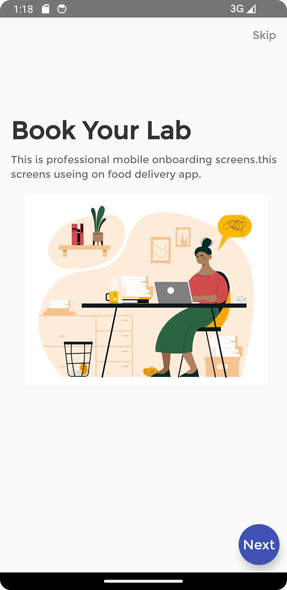   

#### Step 2
In this step we will work on MainActivity to load all Laboratories from API to and display in Android Recycler View 
In build.gradle(Module App), under dependencies add below lines and sync Project.

    //LoopJ for API Connections
    implementation 'com.loopj.android:android-async-http:1.4.9'
    
    // For JSON Conversions, From JSONArray to ArrayList
    implementation 'com.google.code.gson:gson:2.8.7'

    //For Swipe Refresh in Recycler View
    implementation 'androidx.swiperefreshlayout:swiperefreshlayout:1.1.0'

    //For making rounded circular imageView
    implementation 'de.hdodenhof:circleimageview:3.0.1'

Sync Your Project

In helpers Package, Add API Helper from https://justpaste.it/bewc2    

Under models Package, create a Kotlin Class Lab.kt and write below code.
Below code creates/defines our variables as per the Laboratories API.
This model will be used in Our Recycler View Adapter to define our data 
NB: The variable names MUST be the same as keys in your API.

Lab.kt

    //Package ...
    class Lab (
      val email: String = "",
      val lab_id:String = "",
      val lab_name: String = "",
      val permit_id: String = "",
      val phone: String = "",
      val reg_date: String = ""
    )

   
Next, in res/layout, create a file named single_lab.xml and place below code, This file will be used by our LabAdapter 
in below code, we use de.hdodenhof.circleimageview.CircleImageView and place screen11 image on It.
single_lab.xml

    <?xml version="1.0" encoding="utf-8"?>
    <androidx.cardview.widget.CardView
    xmlns:app="http://schemas.android.com/apk/res-auto"
    xmlns:android="http://schemas.android.com/apk/res/android"
    android:layout_width="match_parent"
    android:layout_height="wrap_content"
    app:cardElevation="10dp"
    android:layout_margin="8dp"
    app:cardCornerRadius="5dp">
    
    <RelativeLayout
    android:layout_width="match_parent"
    android:layout_height="100dp">
    
        <de.hdodenhof.circleimageview.CircleImageView
            android:id="@+id/labimage"
            android:layout_width="55dp"
            android:layout_height="55dp"
            android:src="@drawable/screen1"
            android:layout_centerVertical="true"
            android:layout_marginLeft="10dp"/>
    
           <LinearLayout
               android:id="@+id/linear1"
               android:layout_width="wrap_content"
               android:layout_height="wrap_content"
               android:layout_centerVertical="true"
               android:layout_toEndOf="@id/labimage"
               android:orientation="vertical"
               android:layout_marginLeft="10dp">
    
               <com.google.android.material.textview.MaterialTextView
                   android:layout_width="wrap_content"
                   android:layout_height="wrap_content"
                   android:text="Lancet Pathologists"
                   android:textStyle="bold"
                   android:textSize="16sp"
                   android:fontFamily="@font/montserrat"
                   android:textColor="@color/black"
                   android:id="@+id/lab_name"/>
    
               <com.google.android.material.textview.MaterialTextView
                   android:layout_width="wrap_content"
                   android:layout_height="wrap_content"
                   android:text="Permit ID: 457878"
                   android:textStyle="normal"
                   android:textSize="12sp"
                   android:fontFamily="@font/montserrat"
                   android:textColor="#787474"
                   android:layout_marginTop="6dp"
                   android:id="@+id/permit_id"/>
           </LinearLayout>
    
          <LinearLayout
              android:layout_width="wrap_content"
              android:layout_height="wrap_content"
    
              android:layout_below="@id/linear1"
              android:layout_marginTop="5dp"
              android:layout_marginLeft="20dp"
              android:orientation="vertical">
    
              <com.google.android.material.textview.MaterialTextView
                  android:layout_width="wrap_content"
                  android:layout_height="wrap_content"
                  android:text="lancet@gmail.com"
                  android:textStyle="bold"
                  android:textSize="15sp"
                  android:fontFamily="@font/montserrat"
                  android:textColor="#FF5722"
                  android:layout_marginTop="6dp"
                  android:id="@+id/email"/>
          </LinearLayout>
    </RelativeLayout>
    </androidx.cardview.widget.CardView>

The layout above shows how a single item is displayed on RecyclerView

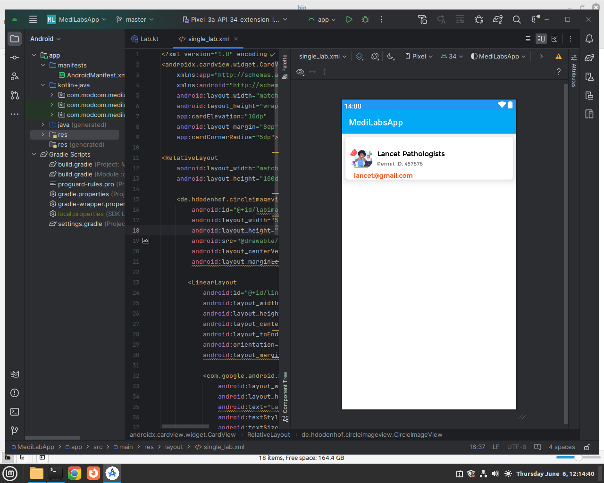
 
In adapters Package, Create a Class File named LabAdapter.kt and write below code  
        LabAdapter.kt       

        package com.modcom.medilabsapp.adapters
        import android.content.Context
        import android.view.LayoutInflater
        import android.view.View
        import android.view.ViewGroup
        import androidx.recyclerview.widget.RecyclerView
        import com.google.android.material.textview.MaterialTextView
        import com.modcom.medilabsapp.R
        import com.modcom.medilabsapp.models.Lab
        
        //We provide context in below class to make it be like an activity
        class LabAdapter(var context: Context):
        RecyclerView.Adapter<LabAdapter.ViewHolder>() {
            //Create a List and connect it with our model
            var itemList : List<Lab> = listOf() //Its empty
        
            //Create a Class here, will hold our views in single_lab xml
            inner class  ViewHolder(itemView: View):  RecyclerView.ViewHolder(itemView)

            //Access single_lab XML
            override fun onCreateViewHolder(parent: ViewGroup, viewType: Int): LabAdapter.ViewHolder {
                //access/inflate the single lab xml
                val view = LayoutInflater.from(parent.context).inflate(R.layout.single_lab,
                    parent, false)
        
                return ViewHolder(view) //pass the single lab to ViewHolder
            }
            
            // Bind data to Views from single_lab XML
            override fun onBindViewHolder(holder: LabAdapter.ViewHolder, position: Int) {
                 //Find your 3 text views
                val lab_name = holder.itemView.findViewById<MaterialTextView>(R.id.lab_name)
                val permit_id = holder.itemView.findViewById<MaterialTextView>(R.id.permit_id)
                val email = holder.itemView.findViewById<MaterialTextView>(R.id.email)
                //Assume one Lab, and bind data, it will loop other Labs
                 val lab = itemList[position]
                 lab_name.text = lab.lab_name
                 permit_id.text = "Permit ID: "+lab.permit_id
                 email.text = lab.email
                //When one Lab is clicked, Move to Lab tests Activity
                 holder.itemView.setOnClickListener {
                    //To Navigate to LabTests on each Lab Click
                     
                 }
        
            }
            //Count Number of items
            override fun getItemCount(): Int {
                return itemList.size  //Count how may Items in the List
            }

            
            //This is for filtering data
            fun filterList(filterList: List<Lab>){
                itemList = filterList
                notifyDataSetChanged()
            }
            
        
            //Earlier we mentioned item List is empty!
            //We will get data from our APi, then bring it to below function
            //The data you bring here must follow the Lab model
            fun setListItems(data: List<Lab>){
                itemList = data //map/link the data to itemlist
                notifyDataSetChanged()
                //Tell this adapter class that now itemList is loaded with data
            }
            //justpaste.it/cgaym
        }

Go to activity_main.xml and Place this code which has a ProgressBar , SwipeRefresh and a RecyclerView  

        <?xml version="1.0" encoding="utf-8"?>
        <LinearLayout
        xmlns:android="http://schemas.android.com/apk/res/android"
        xmlns:app="http://schemas.android.com/apk/res-auto"
        xmlns:tools="http://schemas.android.com/tools"
        android:layout_width="match_parent"
        android:layout_height="match_parent"
        android:orientation="vertical"
        tools:context=".MainActivity">
        
            <ProgressBar
                android:layout_width="match_parent"
                android:layout_height="wrap_content"
                android:layout_margin="3dp"
                android:id="@+id/progress"/>

            <androidx.swiperefreshlayout.widget.SwipeRefreshLayout
                android:layout_width="match_parent"
                android:layout_height="wrap_content"
                android:id="@+id/swipeRefreshLayout">
            
                <androidx.recyclerview.widget.RecyclerView
                    android:id="@+id/recycler"
                    android:layout_width="match_parent"
                    android:layout_height="match_parent"
                    tools:listitem="@layout/single_lab"/>
            
            </androidx.swiperefreshlayout.widget.SwipeRefreshLayout>

        </LinearLayout>

In MainActivity.kt Write below code.

        package com.modcom.medilabsapp
        import androidx.appcompat.app.AppCompatActivity
        import android.os.Bundle
        import android.util.Log
        import android.view.View
        import android.widget.ProgressBar
        import android.widget.Toast
        import androidx.recyclerview.widget.LinearLayoutManager
        import androidx.recyclerview.widget.RecyclerView
        import com.google.gson.GsonBuilder
        import com.modcom.medilabsapp.adapters.LabAdapter
        import com.modcom.medilabsapp.constants.Constants
        import com.modcom.medilabsapp.helpers.ApiHelper
        import com.modcom.medilabsapp.models.Lab
        import org.json.JSONArray
        import org.json.JSONObject
        
        class MainActivity : AppCompatActivity() {
        //Global Declaration - they can be accessed all over this class.
        // Declare variables as lateinit means they are guaranteed to be initialized in the future
        lateinit var itemList: List<Lab>
        lateinit var labAdapter: LabAdapter
        lateinit var recyclerView: RecyclerView
        lateinit var progress: ProgressBar
        
        
        
            override fun onCreate(savedInstanceState: Bundle?) {
                super.onCreate(savedInstanceState)
                setContentView(R.layout.activity_main)
                //Find Views
                progress = findViewById(R.id.progress)
                recyclerView = findViewById(R.id.recycler)
                //Link to adapter
                labAdapter = LabAdapter(applicationContext)
                //Set recycler adapter layout manager
                recyclerView.layoutManager = LinearLayoutManager(applicationContext)
                recyclerView.setHasFixedSize(true)
                //Call the function to fetch data
                fetchData()
        
            }//end Oncreate
        
            // FUnctions to Fetch Laboratories from API and Bind then in Recycler View
            fun fetchData(){
                //Go to the PAi get the dataapplicationContextthis
                val api = Constants.BASE_URL+"/laboratories"
                val helper = ApiHelper(this@MainActivity)
                helper.get(api, object: ApiHelper.CallBack{
                    override fun onSuccess(result: JSONArray?) {
                        //Take above result to adapter
                        //Convert Above result from JSON array to LIST<Lab>
                        val gson = GsonBuilder().create()
                        itemList = gson.fromJson(result.toString(),
                            Array<Lab>::class.java).toList()
                        //Finally, our adapter has the data
                        labAdapter.setListItems(itemList)
                        //For the sake of recycling/Looping items, add the adapter to recycler
                        recyclerView.adapter = labAdapter
                        progress.visibility = View.GONE
        
                    }//end
        
                    override fun onSuccess(result: JSONObject?) {
        
                    }
        
                    override fun onFailure(result: String?) {
                        Toast.makeText(applicationContext, "Error:"+result.toString(),
                            Toast.LENGTH_SHORT).show()
                        Log.d("failureerrors", result.toString())
                        progress.visibility = View.GONE
                    }
                })
            }//end fetch data
        
            //End
        }

Run your App
 

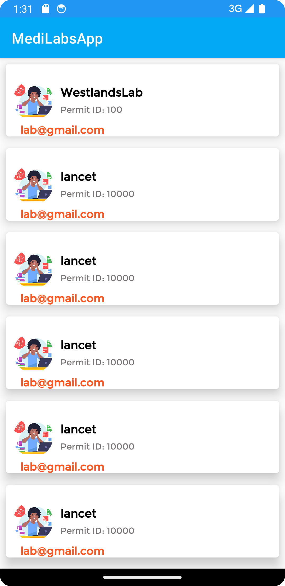

Adding Swipe Refresh, We already have a SwipeRefresh View in activity_main.xml, in MainActivity.kt we just need to find it and apply a swipe refresh listener.  
Below is updated code with SwipeRefresh

        package com.modcom.medilabsapp
        import androidx.appcompat.app.AppCompatActivity
        import android.os.Bundle
        import android.util.Log
        import android.view.View
        import android.widget.ProgressBar
        import android.widget.Toast
        import androidx.recyclerview.widget.LinearLayoutManager
        import androidx.recyclerview.widget.RecyclerView
        import androidx.swiperefreshlayout.widget.SwipeRefreshLayout
        import com.google.gson.GsonBuilder
        import com.modcom.medilabsapp.adapters.LabAdapter
        import com.modcom.medilabsapp.constants.Constants
        import com.modcom.medilabsapp.helpers.ApiHelper
        import com.modcom.medilabsapp.models.Lab
        import org.json.JSONArray
        import org.json.JSONObject
        
        class MainActivity : AppCompatActivity() {
        //Global Declaration - they can be accessed all over this class
        lateinit var itemList: List<Lab>
        lateinit var labAdapter: LabAdapter
        lateinit var recyclerView: RecyclerView
        lateinit var progress: ProgressBar
        //add Swipe refresh declaration
        lateinit var swiperefresh: SwipeRefreshLayout
        
        
            override fun onCreate(savedInstanceState: Bundle?) {
                super.onCreate(savedInstanceState)
                setContentView(R.layout.activity_main)
                //Find Views
                progress = findViewById(R.id.progress)
                recyclerView = findViewById(R.id.recycler)
                //Link to adapter
                labAdapter = LabAdapter(applicationContext)
                //Set recycler adapter layout manager
                recyclerView.layoutManager = LinearLayoutManager(applicationContext)
                recyclerView.setHasFixedSize(true)
                //Call the function to fetch data
                fetchData()
                //FInd swipe refresh and set refresh Listener
                swiperefresh = findViewById<SwipeRefreshLayout>(R.id.swipeRefreshLayout)
                swiperefresh.setOnRefreshListener {
                    fetchData()// fetch data again
                }//end refresh
        
            }//end Oncreate
        
            fun fetchData(){
                //Go to the PAi get the dataapplicationContextthis
                val api = Constants.BASE_URL+"/laboratories"
                val helper = ApiHelper(this@MainActivity)
                helper.get(api, object: ApiHelper.CallBack{
                    override fun onSuccess(result: JSONArray?) {
                        //Take above result to adapter
                        //Convert Above result from JSON array to LIST<Lab>
                        val gson = GsonBuilder().create()
                        itemList = gson.fromJson(result.toString(),
                            Array<Lab>::class.java).toList()
                        //Finally, our adapter has the data
                        labAdapter.setListItems(itemList)
                        //For the sake of recycling/Looping items, add the adapter to recycler
                        recyclerView.adapter = labAdapter
                        //set is progress to gone when records are loaded
                        progress.visibility = View.GONE
                        //set is refreshing to false when records are loaded
                        swiperefresh.isRefreshing = false
        
                    }//end
        
                    override fun onSuccess(result: JSONObject?) {
        
                    }
        
                    override fun onFailure(result: String?) {
                        Toast.makeText(applicationContext, "Error:"+result.toString(),
                            Toast.LENGTH_SHORT).show()
                        Log.d("failureerrors", result.toString())
                        progress.visibility = View.GONE
                    }
                })
            }//end fetch data
        }

Run your App, Observe the Pull Refresh
 

#### Step 3
Adding a Search Filter.  
In activity_main.xml and an EditText for search  
Below is updated activity_main.xml  

        <?xml version="1.0" encoding="utf-8"?>
        <LinearLayout
        xmlns:android="http://schemas.android.com/apk/res/android"
        xmlns:app="http://schemas.android.com/apk/res-auto"
        xmlns:tools="http://schemas.android.com/tools"
        android:layout_width="match_parent"
        android:layout_height="match_parent"
        android:orientation="vertical"
        tools:context=".MainActivity">

            <EditText
                android:layout_width="match_parent"
                android:layout_height="wrap_content"
                android:hint="Search Lab name.."
                android:drawableStart="@android:drawable/ic_menu_search"
                android:layout_margin="5dp"
                android:id="@+id/etsearch"/>
            
            <ProgressBar
                android:layout_width="match_parent"
                android:layout_height="wrap_content"
                android:layout_margin="3dp"
                android:id="@+id/progress"/>
        
        
        <androidx.swiperefreshlayout.widget.SwipeRefreshLayout
        android:layout_width="match_parent"
        android:layout_height="wrap_content"
        android:id="@+id/swipeRefreshLayout">
        
            <androidx.recyclerview.widget.RecyclerView
                android:id="@+id/recycler"
                android:layout_width="match_parent"
                android:layout_height="match_parent"
                tools:listitem="@layout/single_lab"/>
        
        </androidx.swiperefreshlayout.widget.SwipeRefreshLayout>
    </LinearLayout>

In LabAdapter.kt, add below function
This function will be used by filter function to filter the Array list of Labs

    fun filterList(filterList: List<LabTests>){
       itemList = filterList
       notifyDataSetChanged()
    }

Next in MainActivity.kt add below function code from https://justpaste.it/9j21s
This filter function filters data in the recycler view using the Adapter

           private fun filter(text: String) {
            // creating a new array list to filter our data.
            val filteredlist: ArrayList<Lab> = ArrayList()
    
            // running a for loop to compare elements.
            for (item in itemList) {
                // checking if the entered string matched with any item of our recycler view.
                if (item.lab_name.lowercase().contains(text.lowercase())) {
                    // if the item is matched we are
                    // adding it to our filtered list.
                    filteredlist.add(item)
                }
            }
            if (filteredlist.isEmpty()) {
                // if no item is added in filtered list we are
                // displaying a toast message as no data found.
                //Toast.makeText(this, "No Data Found..", Toast.LENGTH_SHORT).show()
                labAdapter.filterList(filteredlist)
            } else {
                // at last we are passing that filtered
                // list to our adapter class.
                labAdapter.filterList(filteredlist)
            }
        }

Then in MainActivity.kt inside oncreate function write below code.
Below code adds a Text Changed Listener to EditText, onTextChanged it calls filter function

              //Filter Labs
                val etsearch = findViewById<EditText>(R.id.etsearch)
                etsearch.addTextChangedListener(object: TextWatcher{
                    override fun beforeTextChanged(p0: CharSequence?, p1: Int, p2: Int, p3: Int) {
        
                    }
        
                    override fun onTextChanged(texttyped: CharSequence?, p1: Int, p2: Int, p3: Int) {
                         filter(texttyped.toString())
                    }
        
                    override fun afterTextChanged(p0: Editable?) {
        
                    }
        
                })

Final Code for MainActivity.kt

    package com.modcom.medilabsapp
    import androidx.appcompat.app.AppCompatActivity
    import android.os.Bundle
    import android.text.Editable
    import android.text.TextWatcher
    import android.util.Log
    import android.view.View
    import android.widget.EditText
    import android.widget.ProgressBar
    import android.widget.Toast
    import androidx.recyclerview.widget.LinearLayoutManager
    import androidx.recyclerview.widget.RecyclerView
    import androidx.swiperefreshlayout.widget.SwipeRefreshLayout
    import com.google.gson.GsonBuilder
    import com.modcom.medilabsapp.adapters.LabAdapter
    import com.modcom.medilabsapp.constants.Constants
    import com.modcom.medilabsapp.helpers.ApiHelper
    import com.modcom.medilabsapp.models.Lab
    import org.json.JSONArray
    import org.json.JSONObject
    
    class MainActivity : AppCompatActivity() {
    //Global Declaration - they can be accessed all over this class
    lateinit var itemList: List<Lab>
    lateinit var labAdapter: LabAdapter
    lateinit var recyclerView: RecyclerView
    lateinit var progress: ProgressBar
    lateinit var swiperefresh: SwipeRefreshLayout
    
    
        override fun onCreate(savedInstanceState: Bundle?) {
            super.onCreate(savedInstanceState)
            setContentView(R.layout.activity_main)
    
            progress = findViewById(R.id.progress)
            recyclerView = findViewById(R.id.recycler)
            labAdapter = LabAdapter(applicationContext)
            recyclerView.layoutManager = LinearLayoutManager(applicationContext)
            recyclerView.setHasFixedSize(true)
            //Call the function
            fetchData()
            swiperefresh = findViewById<SwipeRefreshLayout>(R.id.swipeRefreshLayout)
            swiperefresh.setOnRefreshListener {
                fetchData()// fetch data again
            }//end refresh
    
            //Filter Labs
            val etsearch = findViewById<EditText>(R.id.etsearch)
            etsearch.addTextChangedListener(object: TextWatcher{
                override fun beforeTextChanged(p0: CharSequence?, p1: Int, p2: Int, p3: Int) {
    
                }
    
                override fun onTextChanged(texttyped: CharSequence?, p1: Int, p2: Int, p3: Int) {
                     filter(texttyped.toString())
                }
    
                override fun afterTextChanged(p0: Editable?) {
    
                }
    
            })
        }//end Oncreate
    
        fun fetchData(){
            //Go to the PAi get the dataapplicationContextthis
            val api = Constants.BASE_URL+"/laboratories"
            val helper = ApiHelper(this@MainActivity)
            helper.get(api, object: ApiHelper.CallBack{
                override fun onSuccess(result: JSONArray?) {
                    //Take above result to adapter
                    //Convert Above result from JSON array to LIST<Lab>
                    val gson = GsonBuilder().create()
                    itemList = gson.fromJson(result.toString(),
                        Array<Lab>::class.java).toList()
                    //Finally, our adapter has the data
                    labAdapter.setListItems(itemList)
                    //For the sake of recycling/Looping items, add the adapter to recycler
                    recyclerView.adapter = labAdapter
                    progress.visibility = View.GONE
                    swiperefresh.isRefreshing = false
    
                }//end
    
                override fun onSuccess(result: JSONObject?) {
    
                }
    
                override fun onFailure(result: String?) {
                    Toast.makeText(applicationContext, "Error:"+result.toString(),
                        Toast.LENGTH_SHORT).show()
                    Log.d("failureerrors", result.toString())
                    progress.visibility = View.GONE
                }
    
            })
        }//end fetch data
    
        //Filter function
        //justpaste.it/9j21s
        //Filter
        private fun filter(text: String) {
            // creating a new array list to filter our data.
            val filteredlist: ArrayList<Lab> = ArrayList()
    
            // running a for loop to compare elements.
            for (item in itemList) {
                // checking if the entered string matched with any item of our recycler view.
                if (item.lab_name.lowercase().contains(text.lowercase())) {
                    // if the item is matched we are
                    // adding it to our filtered list.
                    filteredlist.add(item)
                }
            }
            if (filteredlist.isEmpty()) {
                // if no item is added in filtered list we are
                // displaying a toast message as no data found.
                //Toast.makeText(this, "No Data Found..", Toast.LENGTH_SHORT).show()
                labAdapter.filterList(filteredlist)
            } else {
                // at last we are passing that filtered
                // list to our adapter class.
                labAdapter.filterList(filteredlist)
            }
        }
    }

Run your App
 

Creating a LabTestActivity which will show LabTest when one Lab is clicked from above screenshot  

In models Package create a Class File named LabTests.kt and write below code  
LabTests.kt

    class LabTests (
        val availability: String = "",
        var lab_id: String = "",
        val more_info: String = "",
        val reg_date: String = "",
        var test_description: String = "",
        val test_discount: String = "",
        var test_cost: String = "",
        var test_id: String = "",
        var test_name: String = "",
    )

Above the variable names Must be same as your API keys  
The Recycler View that will display the Lab Tests is more similar with the one displaying the Lab, so the process is same  

in res/layout create a file named single_labtests.xml and write below code.
single_labtests.xml

        <?xml version="1.0" encoding="utf-8"?>
        <androidx.cardview.widget.CardView
        xmlns:app="http://schemas.android.com/apk/res-auto"
        xmlns:android="http://schemas.android.com/apk/res/android"
        android:layout_width="match_parent"
        android:layout_height="wrap_content"
        app:cardElevation="10dp"
        android:layout_margin="8dp"
        app:cardCornerRadius="5dp">
        
            <RelativeLayout
                android:layout_width="match_parent"
                android:layout_height="120dp">
        
                <de.hdodenhof.circleimageview.CircleImageView
                    android:id="@+id/labimage"
                    android:layout_width="55dp"
                    android:layout_height="55dp"
                    android:src="@drawable/screen1"
                    android:layout_centerVertical="true"
                    android:layout_marginLeft="10dp"/>
        
                <LinearLayout
                    android:id="@+id/linear1"
                    android:layout_width="wrap_content"
                    android:layout_height="wrap_content"
                    android:layout_centerVertical="true"
                    android:layout_toEndOf="@id/labimage"
                    android:orientation="vertical"
                    android:layout_marginLeft="10dp">
        
                    <com.google.android.material.textview.MaterialTextView
                        android:layout_width="wrap_content"
                        android:layout_height="wrap_content"
                        android:text="Lipid Profile"
                        android:textStyle="bold"
                        android:textSize="16sp"
                        android:fontFamily="@font/montserrat"
                        android:textColor="@color/black"
                        android:id="@+id/test_name"/>
        
                    <com.google.android.material.textview.MaterialTextView
                        android:layout_width="wrap_content"
                        android:layout_height="wrap_content"
                        android:text="This is a nice Lab tests for keeping Fit, This is a nice test keeping Fit"
                        android:textStyle="normal"
                        android:textSize="12sp"
                        android:maxLines="2"
                        android:fontFamily="@font/montserrat"
                        android:textColor="#787474"
                        android:layout_marginTop="6dp"
                        android:id="@+id/test_description"/>
                </LinearLayout>
        
                <LinearLayout
                    android:layout_width="wrap_content"
                    android:layout_height="wrap_content"
                    android:layout_below="@id/linear1"
                    android:layout_marginTop="5dp"
                    android:layout_marginLeft="10dp"
                    android:layout_marginBottom="5dp"
                    android:orientation="vertical">
        
                    <com.google.android.material.textview.MaterialTextView
                        android:id="@+id/test_cost"
                        android:layout_width="315dp"
                        android:layout_height="wrap_content"
                        android:fontFamily="@font/montserrat"
                        android:text="KES 1,200"
                        android:textAlignment="textEnd"
                        android:textColor="#FF5722"
                        android:textSize="15sp"
                        android:textStyle="bold" />
                </LinearLayout>
        
            </RelativeLayout>
        </androidx.cardview.widget.CardView>

in adapters package, Create a Class File named LabTestsAdapter.kt and write below code

        package com.modcom.medilabsapp.adapters
        import android.content.Context
        import android.view.LayoutInflater
        import android.view.View
        import android.view.ViewGroup
        import androidx.recyclerview.widget.RecyclerView
        import com.google.android.material.textview.MaterialTextView
        import com.modcom.medilabsapp.R
        import com.modcom.medilabsapp.models.LabTests
        
        class LabTestsAdapter(var context: Context):
        RecyclerView.Adapter<LabTestsAdapter.ViewHolder>() {
        
        
            //Create a List and connect it with our model
            var itemList : List<LabTests> = listOf() //Its empty
        
            //Create a Class here, will hold our views in single_lab xml
            inner class  ViewHolder(itemView: View):  RecyclerView.ViewHolder(itemView)
        
            override fun onCreateViewHolder(parent: ViewGroup, viewType: Int): LabTestsAdapter.ViewHolder {
                //access/inflate the single labtests xml
                val view = LayoutInflater.from(parent.context).inflate(R.layout.single_labtests,
                    parent, false)
        
                return ViewHolder(view) //pass the single lab to ViewHolder
            }
        
            override fun onBindViewHolder(holder: LabTestsAdapter.ViewHolder, position: Int) {
                 //Find your 3 text views
                val test_name = holder.itemView.findViewById<MaterialTextView>(R.id.test_name)
                val test_description = holder.itemView.findViewById<MaterialTextView>(R.id.test_description)
                val test_cost = holder.itemView.findViewById<MaterialTextView>(R.id.test_cost)
                //Assume one Lab, bind data, 
                 val item = itemList[position]
                 test_name.text = item.test_name
                 test_description.text = item.test_description
                 test_cost.text = item.test_cost+" KES"
                 holder.itemView.setOnClickListener {
                    //To Navigate to single item Activity
                 }//end
        
        
        
               // Toast.makeText(context, "yyy"+item.test_cost, Toast.LENGTH_SHORT).show()
            }
        
            //count number of items
            override fun getItemCount(): Int {
                return itemList.size  //Count how may Items in the List
            }
        
            //This is for filtering data
            fun filterList(filterList: List<LabTests>){
                itemList = filterList
                notifyDataSetChanged()
            }
        
        
            //Earlier we mentioned item List is empty!
            //We will get data from our APi, then bring it to below function
            //The data you bring here must follow the Lab model
            fun setListItems(data: List<LabTests>){
                itemList = data //map/link the data to itemlist
                notifyDataSetChanged()
            //Tell this adapter class that now itemList is loaded with data
            }
            //justpaste.it/cgaym
        }

In your main Package create an Empty Views Activity named LabTestsActivity and write below code.
NB: Below code is 90% same as MainActivity we did for Laboratories.  

        package com.modcom.medilabsapp
        import androidx.appcompat.app.AppCompatActivity
        import android.os.Bundle
        import android.text.Editable
        import android.text.TextWatcher
        import android.util.Log
        import android.view.View
        import android.widget.EditText
        import android.widget.ProgressBar
        import android.widget.Toast
        import androidx.recyclerview.widget.LinearLayoutManager
        import androidx.recyclerview.widget.RecyclerView
        import androidx.swiperefreshlayout.widget.SwipeRefreshLayout
        import com.google.gson.GsonBuilder
        import com.modcom.medilabsapp.adapters.LabAdapter
        import com.modcom.medilabsapp.adapters.LabTestsAdapter
        import com.modcom.medilabsapp.constants.Constants
        import com.modcom.medilabsapp.helpers.ApiHelper
        import com.modcom.medilabsapp.models.Lab
        import com.modcom.medilabsapp.models.LabTests
        import org.json.JSONArray
        import org.json.JSONObject
        
        class LabTestsActivity : AppCompatActivity() {
        lateinit var itemList: List<LabTests>
        lateinit var labtestAdapter: LabTestsAdapter
        lateinit var recyclerView: RecyclerView
        lateinit var progress: ProgressBar
        lateinit var swiperefresh: SwipeRefreshLayout
        
            override fun onCreate(savedInstanceState: Bundle?) {
                super.onCreate(savedInstanceState)
                setContentView(R.layout.activity_lab_tests)
        
        
                progress = findViewById(R.id.progress)
                recyclerView = findViewById(R.id.recycler)
                labtestAdapter = LabTestsAdapter(applicationContext)
                recyclerView.layoutManager = LinearLayoutManager(applicationContext)
                recyclerView.setHasFixedSize(true)
        
                post_fetch()
        
                swiperefresh = findViewById<SwipeRefreshLayout>(R.id.swipeRefreshLayout)
                swiperefresh.setOnRefreshListener {
                    post_fetch()// fetch data again
                }//end refresh
        
                //Filter labs
                val etsearch = findViewById<EditText>(R.id.etsearch)
                etsearch.addTextChangedListener(object: TextWatcher {
                    override fun beforeTextChanged(p0: CharSequence?, p1: Int, p2: Int, p3: Int) {
        
                    }
        
                    override fun onTextChanged(texttyped: CharSequence?, p1: Int, p2: Int, p3: Int) {
                        filter(texttyped.toString())
                    }
        
                    override fun afterTextChanged(p0: Editable?) {
        
                    }
        
                })
        
        
        
        
            }//end oncreate
        
            
            fun post_fetch(){
                val api = Constants.BASE_URL+"/lab_tests"
                //Above APi needs a Body, So we have to build it
                val body = JSONObject()
                //Retrieve the id from Intent Extras - To Add this ID to bundles extras Later
                val id = intent.extras?.getString("key1")
                //Toast.makeText(applicationContext, "ID $id", Toast.LENGTH_SHORT).show()
                //provide the ID to the API
                body.put("lab_id", id) //NB: 4 is static
                val helper = ApiHelper(applicationContext)
                helper.post(api, body, object : ApiHelper.CallBack{
                    override fun onSuccess(result: JSONArray?) {
                        val gson = GsonBuilder().create()
                        itemList = gson.fromJson(result.toString(),
                            Array<LabTests>::class.java).toList()
                        //Finally, our adapter has the data
                        labtestAdapter.setListItems(itemList)
                        //For the sake of recycling/Looping items, add the adapter to recycler
                        recyclerView.adapter = labtestAdapter
                        progress.visibility = View.GONE
                        swiperefresh.isRefreshing = false
                    }
                    override fun onSuccess(result: JSONObject?) {
                        Toast.makeText(applicationContext, result.toString(),
                            Toast.LENGTH_SHORT).show()
                        progress.visibility = View.GONE
                    }
        
                    override fun onFailure(result: String?) {
                        Toast.makeText(applicationContext, "Error:"+result.toString(),
                            Toast.LENGTH_SHORT).show()
                        Log.d("failureerrors", result.toString())
                    }
                })
            }//end fetch
        
        
            private fun filter(text: String) {
                // creating a new array list to filter our data.
                val filteredlist: ArrayList<LabTests> = ArrayList()
                // running a for loop to compare elements.
                for (item in itemList) {
                    // checking if the entered string matched with any item of our recycler view.
                    if (item.test_name.lowercase().contains(text.lowercase())) {
                        // if the item is matched we are
                        // adding it to our filtered list.
                        filteredlist.add(item)
                    }
                }
                if (filteredlist.isEmpty()) {
                    // if no item is added in filtered list we are
                    // displaying a toast message as no data found.
                    //Toast.makeText(this, "No Data Found..", Toast.LENGTH_SHORT).show()
                    labtestAdapter.filterList(filteredlist)
                } else {
                    // at last we are passing that filtered
                    // list to our adapter class.
                    labtestAdapter.filterList(filteredlist)
                }
            }
        
        }

In above code we have a function named Post fetch, see it below  

          fun post_fetch(){
                val api = Constants.BASE_URL+"/lab_tests"

                //Above APi needs a Body to parse the lab_id, So we have to build the body
                val body = JSONObject()

                //Retrieve the id from Intent Extras
                val id = intent.extras?.getString("key1")
                //Toast.makeText(applicationContext, "ID $id", Toast.LENGTH_SHORT).show()
                //provide the ID to the API
                body.put("lab_id", id) //NB: 4 is static
                val helper = ApiHelper(applicationContext)
                helper.post(api, body, object : ApiHelper.CallBack{
                    override fun onSuccess(result: JSONArray?) {
                        val gson = GsonBuilder().create()
                        itemList = gson.fromJson(result.toString(),
                            Array<LabTests>::class.java).toList()
                        //Finally, our adapter has the data
                        labtestAdapter.setListItems(itemList)
                        //For the sake of recycling/Looping items, add the adapter to recycler
                        recyclerView.adapter = labtestAdapter
                        progress.visibility = View.GONE
                        swiperefresh.isRefreshing = false
                    }
                    override fun onSuccess(result: JSONObject?) {
                        Toast.makeText(applicationContext, result.toString(),
                            Toast.LENGTH_SHORT).show()
                        progress.visibility = View.GONE
                    }
        
                    override fun onFailure(result: String?) {
                        Toast.makeText(applicationContext, "Error:"+result.toString(),
                            Toast.LENGTH_SHORT).show()
                        Log.d("failureerrors", result.toString())
                    }
                })
            }//end fetch

Since the Lab Test API requires a lab_id to return specific lab tests, we have retrieved the lab_id from extras with code below  
We use key1 to retrieve it. 

                //Retrieve the id from Intent Extras
                val id = intent.extras?.getString("key1")

Before we run our code we need to store the lab_id of the Clicked Lab from MainActivity - LabAdapter
This will help above code retrieve that lab_id.

Open your LabAdapter.kt  
On onBindViewHolder  function update the holder set OnclickListener , Update with below code 

           holder.itemView.setOnClickListener {
                 //carry/cpature the Lab_id of what you clicked.
                 //carry it with Bundles
                 val id = lab.lab_id  //lab id
                 //pass this ID along with intent
                 val i = Intent(context, LabTestsActivity::class.java)

                 //We use key1 to save it
                 i.putExtra("key1", id)
                 i.flags = Intent.FLAG_ACTIVITY_NEW_TASK
                 context.startActivity(i)
         }

Now run your App Click on one Lab and it will open its Lab Tests
 
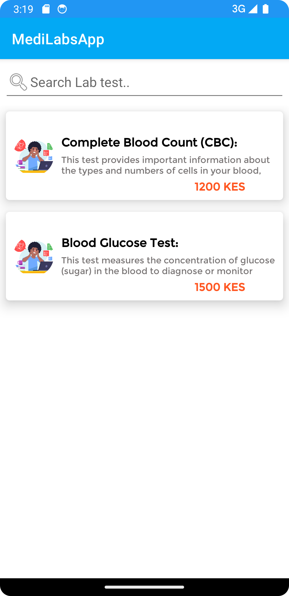

#### Step 3
In this section, when one lab test is clicked from above screen, You will learn how to display it on a Single Screen 
In your Main Package, Create an Empty Views Activity named SingleLabTest  

In LabTestAdapter, Update the onBindViewHolder() function, Update code for holder setonclick listener  
In below code, after a Lab test is clicked from recycler view, we get all its details and add them to Bundle extras, then we navigate to SingleLabTest Activity

        holder.itemView.setOnClickListener {
                val i = Intent(context, SingleLabTest::class.java)
                i.putExtra("lab_id", item.lab_id)
                i.putExtra("test_id", item.test_id)
                i.putExtra("test_discount", item.test_discount)
                i.putExtra("test_cost", item.test_cost)
                i.putExtra("test_name", item.test_name)
                i.putExtra("test_description", item.test_description)
                i.putExtra("availability", item.availability)
                i.putExtra("more_info", item.more_info)
                i.putExtra("reg_date", item.reg_date)
                i.flags = Intent.FLAG_ACTIVITY_NEW_TASK
                context.startActivity(i)
        }//end

In res/layout open <b>activity_single_lab_test.xml</b> and write below code  
This code has TextViews to be used in displaying data for specific lab test. 

        <?xml version="1.0" encoding="utf-8"?>
        <androidx.cardview.widget.CardView
        xmlns:app="http://schemas.android.com/apk/res-auto"
        xmlns:android="http://schemas.android.com/apk/res/android"
        android:layout_width="match_parent"
        android:layout_height="wrap_content"
        app:cardElevation="10dp"
        android:layout_marginTop="10dp"
        android:layout_margin="8dp"
        app:cardCornerRadius="5dp">
        
        <RelativeLayout
        xmlns:tools="http://schemas.android.com/tools"
        android:layout_width="match_parent"
        android:layout_height="match_parent"
        tools:context=".SingleLabTest">
        
            <LinearLayout
                android:layout_width="match_parent"
                android:layout_height="wrap_content"
                android:id="@+id/linear1"
                android:layout_marginTop="10dp"
                android:orientation="horizontal">
                <de.hdodenhof.circleimageview.CircleImageView
                    android:id="@+id/labimage"
                    android:layout_width="55dp"
                    android:layout_height="55dp"
                    android:src="@drawable/screen1"
                    android:layout_centerVertical="true"
                    android:layout_marginLeft="10dp"/>
                <com.google.android.material.textview.MaterialTextView
                    android:layout_width="match_parent"
                    android:layout_height="wrap_content"
                    android:text="Test Y"
                    android:fontFamily="@font/montserrat"
                    android:id="@+id/test_name"
                    android:textStyle="bold"
                    android:textSize="18dp"
                    android:layout_marginTop="10dp"
                    android:layout_marginStart="10dp"
                    android:layout_marginBottom="5dp"/>
            </LinearLayout>
        
            <LinearLayout
                android:layout_width="match_parent"
                android:layout_height="wrap_content"
                android:orientation="horizontal"
                android:layout_marginTop="15dp"
                android:layout_below="@+id/linear1"
                android:id="@+id/linear2">
                <com.google.android.material.textview.MaterialTextView
                android:layout_width="match_parent"
                android:layout_height="match_parent"
                android:text="Dummy Desc Dummy DescDummy scDummy DescDummy DescDummy DescDummy DescDummy DescDummy DescDummy Desc"
                android:fontFamily="@font/montserrat"
                android:id="@+id/test_description"
                android:textStyle="normal"
                android:textSize="13dp"
                android:layout_marginBottom="5dp"/>
            </LinearLayout>
        
            <LinearLayout
                android:layout_width="match_parent"
                android:layout_height="wrap_content"
                android:id="@+id/linear3"
                android:layout_marginTop="15dp"
                android:orientation="horizontal"
                android:layout_below="@id/linear2">
                <com.google.android.material.textview.MaterialTextView
                    android:layout_width="wrap_content"
                    android:layout_height="wrap_content"
                    android:text="5% OFF"
                    android:id="@+id/test_discount"
                    android:fontFamily="@font/montserrat"
                    android:textStyle="bold"
                    android:textSize="40dp"
                    android:padding="10dp"
                    android:textColor="#FF9800"
                    android:layout_marginBottom="5dp"/>
                <com.google.android.material.textview.MaterialTextView
                    android:layout_width="match_parent"
                    android:layout_height="wrap_content"
                    android:text="KES 2,300"
                    android:id="@+id/test_cost"
                    android:fontFamily="@font/montserrat"
                    android:textStyle="bold"
                    android:textSize="25dp"
                    android:textColor="@color/black"
                    android:layout_marginBottom="5dp"/>
            </LinearLayout>
        
        
            <LinearLayout
                android:layout_width="match_parent"
                android:layout_height="wrap_content"
                android:id="@+id/linear4"
                android:layout_marginTop="10dp"
                android:orientation="vertical"
                android:layout_below="@id/linear3">
        
                <com.google.android.material.textview.MaterialTextView
                    android:layout_width="match_parent"
                    android:layout_height="wrap_content"
                    android:text="Dummy Avalability"
                    android:fontFamily="@font/montserrat"
                    android:id="@+id/availability"
                    android:textStyle="bold"
                    android:textSize="14dp"
                    android:layout_marginBottom="5dp"/>
                <com.google.android.material.textview.MaterialTextView
                    android:layout_width="match_parent"
                    android:layout_height="wrap_content"
                    android:text="Dummy Info"
                    android:fontFamily="@font/montserrat"
                    android:id="@+id/more_info"
                    android:textSize="12dp"
                    android:layout_marginBottom="5dp"/>
                <com.google.android.material.button.MaterialButton
                    android:layout_width="wrap_content"
                    android:layout_height="wrap_content"
                    android:text= "Add to Cart"
                    android:fontFamily="@font/montserrat"
                    android:layout_margin="10dp"
                    android:id="@+id/addcart"/>
            </LinearLayout>
        
        
        </RelativeLayout>
        </androidx.cardview.widget.CardView>

In SingleLabTest Activity, write below code.
In this code we get data from Bundle extras and place in Text Views

            package com.modcom.medilabsapp
            import android.content.Intent
            import androidx.appcompat.app.AppCompatActivity
            import android.os.Bundle
            import com.google.android.material.button.MaterialButton
            import com.google.android.material.textview.MaterialTextView
            
            class SingleLabTest : AppCompatActivity() {
            
                override fun onCreate(savedInstanceState: Bundle?) {
                    super.onCreate(savedInstanceState)
                    setContentView(R.layout.activity_single_lab_test)

                    
                    //find the textViews, get data from extras and place it in the textview
                    val tvtest_name = findViewById<MaterialTextView>(R.id.test_name)
                    val test_name = intent.extras?.getString("test_name")
                    tvtest_name.text = test_name
                    //==============
                    val tvtest_cost = findViewById<MaterialTextView>(R.id.test_cost)
                    val test_cost = intent.extras?.getString("test_cost")
                    tvtest_cost.text = "$test_cost KES"
                    //==============
                    val tvtest_discount = findViewById<MaterialTextView>(R.id.test_discount)
                    val test_discount = intent.extras?.getString("test_discount")
                    tvtest_discount.text = "$test_discount % OFF"
                    //==============
                    val tvtest_description = findViewById<MaterialTextView>(R.id.test_description)
                    val test_description = intent.extras?.getString("test_description")
                    tvtest_description.text = test_description
                    //==============
                    val tvtest_availability = findViewById<MaterialTextView>(R.id.availability)
                    val availability = intent.extras?.getString("availability")
                    tvtest_availability.text = availability
                    //=================
                    val tvtest_info = findViewById<MaterialTextView>(R.id.more_info)
                    val more_info = intent.extras?.getString("more_info")
                    tvtest_info.text = more_info
            
                    val addcart = findViewById<MaterialButton>(R.id.addcart)
                    //To DO add to cart 
            
                }//end oncreate
            
                //on Back Pressed go back to main activity
                override fun onBackPressed() {
                    val i = Intent(applicationContext, MainActivity::class.java)
                    startActivity(i)
                    finishAffinity()
                }
            }//end class

Run your, Click on one Lab, then Click on Lab Test, and see the Lab Test Details.

   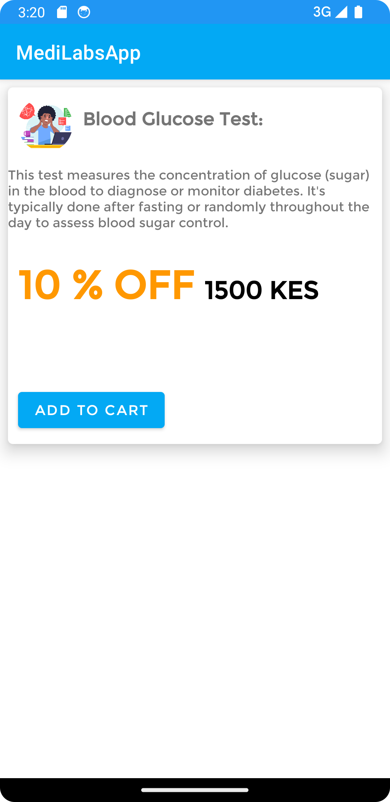

## Part 2
Next, we add a product to the shopping cart, The cart will use SQlite Database, For more on Sqlite 
check https://developer.android.com/kotlin/multiplatform/sqlite  and https://www.geeksforgeeks.org/android-sqlite-database-in-kotlin/

### Step 1
In your project helpers package, create a kotlin class file named SQLiteCartHelper.kt

In this file create an Sqlite Helper as below

        package com.modcom.medilabsapp.helpers
        import android.content.Context
        import android.database.sqlite.SQLiteDatabase
        import android.database.sqlite.SQLiteOpenHelper
        
        
        class SQLiteCartHelper(context: Context): SQLiteOpenHelper(context, "cart.db", null, 1) {
            override fun onCreate(sql: SQLiteDatabase?) {
                  TODO("Not yet implemented")
            }
        
            override fun onUpgrade(p0: SQLiteDatabase?, p1: Int, p2: Int) {
                TODO("Not yet implemented")
            }
        }

Then create a table under onCreate function and upgrade table under onUpgrade function.

        package com.modcom.medilabsapp.helpers
        import android.content.Context
        import android.database.sqlite.SQLiteDatabase
        import android.database.sqlite.SQLiteOpenHelper
        
        
        class SQLiteCartHelper(context: Context): SQLiteOpenHelper(context, "cart.db", null, 1) {
            override fun onCreate(sql: SQLiteDatabase?) {
                   sql?.execSQL("CREATE TABLE IF NOT EXISTS cart(test_id Integer primary key, test_name varchar, test_cost Integer, lab_id Integer, test_description text)")
            }
        
            override fun onUpgrade(p0: SQLiteDatabase?, p1: Int, p2: Int) {
                sql?.execSQL("DROP TABLE IF EXISTS cart")
            }
        }

### Step 2
Next function is to add data to the cart.db under cart table created in onCreate(), Below is the function., the function accepts 5 parameters.
below is the add function.

    fun insert(test_id: String, test_name: String, test_cost: String,
    test_description: String, lab_id: String){
        
         //Get permissions to write the database
         val db = this.writableDatabase
        
         //Select before insert see if ID already exists
         val values = ContentValues()
         values.put("test_id", test_id)
         values.put("test_name", test_name)
         values.put("lab_id", lab_id)
         values.put("test_cost", test_cost)
         values.put("test_description", test_description)

         //save/insert to cart table
         val result:Long = db.insert("cart", null, values)

         if (result < 1){
             println("Failed to Add")
             Toast.makeText(context, "Item Already in Cart", Toast.LENGTH_SHORT).show()
         }
        else {
             println("Item Added To Cart")
             Toast.makeText(context, "Item Added to cart", Toast.LENGTH_SHORT).show()
         }
    }//end

Testing the Insert 
Go to your SingleLabTest Activity, when the add cart button is clicked, add below code to save a lab test to Cart - SQLite

       val addcart = findViewById<MaterialButton>(R.id.addcart)
        addcart.setOnClickListener {
            val helper = SQLiteCartHelper(applicationContext)
            val lab_id = intent.extras?.getString("lab_id")
            try {
                helper.insert(test_id!!, test_name!!, test_cost!!,
                    test_description!!, lab_id!!)

            }
            catch (e: Exception){
                Toast.makeText(applicationContext, "An Error Occurred.",
                    Toast.LENGTH_SHORT).show()
            }

            //Done
        }//end onclick

### Step 3
The next function, check the number of items saved in our table

       fun getNumItems(): Int {
            //Get permissions to read the database
            val db = this.readableDatabase
            val result: Cursor = db.rawQuery("select * from cart", null)

            //return result count
            return result.count
       } //end

### Step 4
Next, we select all records from the cart, we retrieve all records and loop them in an ArrayList

    fun getAllItems(): ArrayList<LabTests> {
        
        //Get permissions to write the database
        val db = this.writableDatabase
        val items = ArrayList<LabTests>()
        val result: Cursor = db.rawQuery("select * from cart", null)
        //Lets Add  all  rows into the items arrayList
        while (result.moveToNext())
        {
            // access the LabTests Model
            val model = LabTests()
            //Map rows to the model
            model.test_id = result.getString(0)  //Assume one row, test_id
            model.test_name = result.getString(1)  //Assume one row, test_name
            model.test_cost = result.getString(2)  //Assume one row, test_cost
            model.lab_id = result.getString(3)  //Assume one row, test_description
            model.test_description = result.getString(4)  //Assume one row, test_description
            items.add(model)//add model to ArrayList
        }//end while
        return items
    }//end function

### Step 5
After fetching all records, we can now create a function to clear all lab tests from the cart.

    fun clearCart(){
        //Get permissions to write the database
        val db = this.writableDatabase
        db.delete("cart", null, null)
        println("Cart Cleared")
        
        Toast.makeText(context, "Cart Cleared", Toast.LENGTH_SHORT).show()

        //After data is cleared , Navigate MyCart Intent,TODO This later once we create MyCart Class
        val i = Intent(context, MyCart::class.java)
        i.flags = Intent.FLAG_ACTIVITY_NEW_TASK
        context.startActivity(i)
        
    } //end

### Step 6
The Next function deletes a record by ID. This deletes one record  at a time.
     
        //Remove One Item
        fun clearCartById(test_id: String){
            val db = this.writableDatabase

            //Provide the test_id when deleting
            db.delete("cart", "test_id=?", arrayOf(test_id))
            println("Item Id $test_id Removed")

            Toast.makeText(context, "Item Id $test_id Removed", Toast.LENGTH_SHORT).show()
            //After data is cleared , Navigate MyCart Intent,TODO This later once we create MyCart Class
            val i = Intent(context, MyCart::class.java)
            i.flags = Intent.FLAG_ACTIVITY_NEW_TASK
            context.startActivity(i)
         }//end

### Step 7
Below function will be used to find the Total of all items in the Cart
    
       //Find Total Cost
        fun totalCost(): Double {
            val db = this.readableDatabase
            val result: Cursor = db.rawQuery("select test_cost from cart",
                null)
            //Set total to 0.0
            var total: Double = 0.0
            while (result.moveToNext()){
                //the cursor result returns a Lists of test_cost.
                //Loop through as you add them to total
                total += result.getDouble(0)
            }//end while
            //Return the updated total
            return total
        }//End

### Step 8
Below is the Full Code for SQLiteCartHelper.

        package com.modcom.medilabsapp.helpers
        import android.annotation.SuppressLint
        import android.content.ContentValues
        import android.content.Context
        import android.content.Intent
        import android.database.Cursor
        import android.database.sqlite.SQLiteDatabase
        import android.database.sqlite.SQLiteOpenHelper
        import android.widget.Toast
        import com.modcom.medilabsapp.MainActivity
        import com.modcom.medilabsapp.MyCart
        import com.modcom.medilabsapp.SingleLabTest
        import com.modcom.medilabsapp.models.LabTests
        import java.util.zip.DeflaterOutputStream
        
        class SQLiteCartHelper(context: Context):
        SQLiteOpenHelper(context, "cart.db", null, 1) {
        //Make context visible to other functions
        val context = context
        
            //SQLite helps store data Locally on your phone - You can CRUD
            override fun onCreate(sql: SQLiteDatabase?) {
                   sql?.execSQL("CREATE TABLE IF NOT EXISTS cart(test_id Integer primary key, test_name varchar, test_cost Integer, lab_id Integer, test_description text)")
            }
        
            override fun onUpgrade(sql: SQLiteDatabase?, p1: Int, p2: Int) {
                sql?.execSQL("DROP TABLE IF EXISTS cart")
            }
        
            //INSERT/Save to cart
            fun insert(test_id: String, test_name: String, test_cost: String,
            test_description: String, lab_id: String){
                 val db = this.writableDatabase
                 //Select before insert see if ID already exsists
                 val values = ContentValues()
                 values.put("test_id", test_id)
                 values.put("test_name", test_name)
                 values.put("lab_id", lab_id)
                 values.put("test_cost", test_cost)
                 values.put("test_description", test_description)
        
                 //save
                 val result:Long = db.insert("cart", null, values)
        
                 if (result < 1){
                     println("Failed to Add")
                     Toast.makeText(context, "Item Already in Cart", Toast.LENGTH_SHORT).show()
                 }
                else {
                    println("Item Added To Cart")
                   ` //             val i = Intent(context, MyCart::class.java)
                    //             i.flags=Intent.FLAG_ACTIVITY_CLEAR_TOP or Intent.FLAG_ACTIVITY_NEW_TASK
                    //             context.startActivity(i)
                  Toast.makeText(context, "Item Added to cart", Toast.LENGTH_SHORT).show()
            }
            }//end
            
            //Count How may items are there in the cart table
            fun getNumItems(): Int {
                val db = this.readableDatabase
                val result: Cursor = db.rawQuery("select * from cart", null)
                //return result count
                return result.count
            } //end
            
            //Clear all records
            fun clearCart(){
                val db = this.writableDatabase
                db.delete("cart", null, null)
                println("Cart Cleared")
                Toast.makeText(context, "Cart Cleared", Toast.LENGTH_SHORT).show()
                //   val i = Intent(context, MyCart::class.java)
                //   i.flags = Intent.FLAG_ACTIVITY_NEW_TASK
                //   context.startActivity(i)
            
            } //end
            
                //Remove One Item
            fun clearCartById(test_id: String){
                val db = this.writableDatabase
                //Provide the test_id when deleting
                db.delete("cart", "test_id=?", arrayOf(test_id))
                println("Item Id $test_id Removed")
                Toast.makeText(context, "Item Id $test_id Removed", Toast.LENGTH_SHORT).show()
                //    val i = Intent(context, MyCart::class.java)
                //    i.flags = Intent.FLAG_ACTIVITY_NEW_TASK
                //    context.startActivity(i)
            }//end
            
            
             //Find Total Cost
            fun totalCost(): Double {
                val db = this.readableDatabase
                val result: Cursor = db.rawQuery("select test_cost from cart",
                    null)
                //Set total to 0.0
                var total: Double = 0.0
                while (result.moveToNext()){
                    //the cursor result returns a Lists of test_cost.
                    //Loop through as you add them to total
                    total += result.getDouble(0)
                }//end while
                //Return the updated total
                return total
            }//End
         
            //Get all items from the Cart
            fun getAllItems(): ArrayList<LabTests> {
                val db = this.writableDatabase
                val items = ArrayList<LabTests>()
                val result: Cursor = db.rawQuery("select * from cart", null)
                //Lets Add  all  rows into the items arrayList
                while (result.moveToNext())
                {
                    val model = LabTests()
                    //Map rows to the model
                    model.test_id = result.getString(0)  //Assume one row, test_id
                    model.test_name = result.getString(1)  //Assume one row, test_name
                    model.test_cost = result.getString(2)  //Assume one row, test_cost
                    model.lab_id = result.getString(3)  //Assume one row, test_description
                    model.test_description = result.getString(4)  //Assume one row, test_description
                    items.add(model)//add model to ArrayList
                }//end while
                return items
            }//end function
        }
    

## Part 3
### Step 1
In this section, we will create MyCart activity, this activity will display the shopping Cart in a recycler view.
in res/layout, Create a file named single_labtests_cart.xml, In this File write below code, NB: This file is similar to single_labtests created earlier.

        <?xml version="1.0" encoding="utf-8"?>
        <androidx.cardview.widget.CardView
        xmlns:app="http://schemas.android.com/apk/res-auto"
        xmlns:android="http://schemas.android.com/apk/res/android"
        android:layout_width="match_parent"
        android:layout_height="wrap_content"
        app:cardElevation="10dp"
        android:layout_margin="8dp"
        app:cardCornerRadius="5dp">
        
            <LinearLayout
                android:layout_width="match_parent"
                android:layout_height="match_parent"
                android:orientation="vertical">
        
            <RelativeLayout
                android:layout_width="match_parent"
                android:layout_height="wrap_content">
        
                <de.hdodenhof.circleimageview.CircleImageView
                    android:id="@+id/labimage"
                    android:layout_width="55dp"
                    android:layout_height="55dp"
                    android:src="@drawable/screen1"
                    android:layout_centerVertical="true"
                    android:layout_marginLeft="10dp"/>
        
                <LinearLayout
                    android:id="@+id/linear1"
                    android:layout_width="match_parent"
                    android:layout_height="wrap_content"
                    android:layout_centerVertical="true"
                    android:layout_toEndOf="@id/labimage"
                    android:orientation="vertical"
                    android:layout_marginLeft="10dp">
        
                    <com.google.android.material.textview.MaterialTextView
                        android:layout_width="wrap_content"
                        android:layout_height="wrap_content"
                        android:text="Lipid Profile"
                        android:textStyle="bold"
                        android:textSize="16sp"
                        android:fontFamily="@font/montserrat"
                        android:textColor="@color/black"
                        android:id="@+id/test_name"/>
        
                    <com.google.android.material.textview.MaterialTextView
                        android:layout_width="wrap_content"
                        android:layout_height="wrap_content"
                        android:text="This is a nice Lab tests for keeping Fit, This is a nice test keeping Fit"
                        android:textStyle="normal"
                        android:textSize="12sp"
                        android:maxLines="2"
                        android:fontFamily="@font/montserrat"
                        android:textColor="#787474"
                        android:layout_marginTop="6dp"
                        android:id="@+id/test_description"/>
                </LinearLayout>
        
                <LinearLayout
                    android:layout_width="wrap_content"
                    android:layout_height="wrap_content"
                    android:layout_below="@id/linear1"
                    android:layout_marginTop="10dp"
                    android:id="@+id/linear2"
                    android:layout_marginLeft="10dp"
                    android:layout_marginBottom="5dp"
                    android:orientation="vertical">
        
                    <com.google.android.material.textview.MaterialTextView
                        android:id="@+id/test_cost"
                        android:layout_width="315dp"
                        android:layout_height="wrap_content"
                        android:fontFamily="@font/montserrat"
                        android:text="KES 1,200"
                        android:textAlignment="textEnd"
                        android:textColor="#FF5722"
                        android:textSize="15sp"
                        android:textStyle="bold" />
                </LinearLayout>
            </RelativeLayout>
        
            <LinearLayout
                android:layout_width="match_parent"
                android:layout_height="wrap_content"
                android:orientation="vertical"
                android:layout_marginLeft="10dp"
                android:layout_marginRight="10dp">
                <com.google.android.material.button.MaterialButton
                    android:layout_width="100dp"
                    android:layout_height="40dp"
                    android:text="Remove"
                    android:textSize="12sp"
                    android:layout_gravity="right"
                    android:id="@+id/remove"/>
            </LinearLayout>
            </LinearLayout>
        </androidx.cardview.widget.CardView>

### Step 2
Then in adapters package, Create a Kotlin class file named LabTestsCartAdapter.kt and write below code.
NB: This code is similar to LabTestsAdapter.

            package com.modcom.medilabsapp.adapters
            import android.content.Context
            import android.view.LayoutInflater
            import android.view.View
            import android.view.ViewGroup
            import androidx.recyclerview.widget.RecyclerView
            import com.google.android.material.button.MaterialButton
            import com.google.android.material.textview.MaterialTextView
            import com.modcom.medilabsapp.R
            import com.modcom.medilabsapp.models.LabTests
            
            class LabTestsCartAdapter(var context: Context):
            RecyclerView.Adapter<LabTestsCartAdapter.ViewHolder>() {
            
                //Create a List and connect it with our model
                var itemList : List<LabTests> = listOf() //Its empty
                //Create a Class here, will hold our views in single_lab xml
                inner class  ViewHolder(itemView: View):  RecyclerView.ViewHolder(itemView)
            
                override fun onCreateViewHolder(parent: ViewGroup, viewType: Int): LabTestsCartAdapter.ViewHolder {
                    //access/inflate the single lab xml
                    val view = LayoutInflater.from(parent.context).inflate(R.layout.single_labtests_cart,
                        parent, false)
            
                    return ViewHolder(view) //pass the single lab to ViewHolder
                }
            
                override fun onBindViewHolder(holder: LabTestsCartAdapter.ViewHolder, position: Int) {
                     //Find your 3 text views
                    val test_name = holder.itemView.findViewById<MaterialTextView>(R.id.test_name)
                    val test_description = holder.itemView.findViewById<MaterialTextView>(R.id.test_description)
                    val test_cost = holder.itemView.findViewById<MaterialTextView>(R.id.test_cost)
                    //Assume one Lab
                     val item = itemList[position]
                     test_name.text = item.test_name
                     test_description.text = item.test_description
                     test_cost.text = item.test_cost+" KES"
                    //Find remove button and set Listener
                    val remove = holder.itemView.findViewById<MaterialButton>(R.id.remove)
                    remove.setOnClickListener {
                           //TODO it later, to remove an item from cart
                    }
            
                   // Toast.makeText(context, "yyy"+item.test_cost, Toast.LENGTH_SHORT).show()
                }
            
                override fun getItemCount(): Int {
                    return itemList.size  //Count how may Items in the List
                }
            
                //Earlier we mentioned item List is empty!
                //We will get data from our APi, then bring it to below function
                //The data you bring here must follow the Lab model
                fun setListItems(data: List<LabTests>){
                    itemList = data //map/link the data to itemlist
                    notifyDataSetChanged()
                //Tell this adapter class that now itemList is loaded with data
                }
                
            }

### Step 3
In the Main Package, create a new Empty Views Activity named MyCart and write below code

        <?xml version="1.0" encoding="utf-8"?>
        <LinearLayout
        xmlns:android="http://schemas.android.com/apk/res/android"
        xmlns:app="http://schemas.android.com/apk/res-auto"
        xmlns:tools="http://schemas.android.com/tools"
        android:layout_width="match_parent"
        android:orientation="vertical"
        android:layout_margin="10dp"
        android:layout_height="match_parent"
        tools:context=".MyCart">
        
            <com.google.android.material.textview.MaterialTextView
                android:layout_width="match_parent"
                android:layout_height="wrap_content"
                android:text="Total: 2300 KES"
                android:textSize="30sp"
                android:textAlignment="textEnd"
                android:textColor="#FF9800"
                android:layout_margin="10dp"
                android:id="@+id/total"/>
        
            <androidx.recyclerview.widget.RecyclerView
                android:layout_width="match_parent"
                android:layout_height="wrap_content"
                tools:listitem="@layout/single_labtests_cart"
                android:id="@+id/recycler"/>
        
            <com.google.android.material.button.MaterialButton
                android:layout_width="wrap_content"
                android:layout_height="wrap_content"
                android:text = "Checkout"
                android:padding="10dp"
                android:textStyle="bold"
                android:layout_margin="10dp"
                android:id="@+id/checkout"/>

        </LinearLayout>

Above XML will be used to display the shopping Cart and the Total.

### Step 4
In MyCart.kt, Write below code, step by step.

        package com.modcom.medilabsapp

        import androidx.appcompat.app.AppCompatActivity
        import android.os.Bundle
        import android.view.View
        import android.widget.Toast
        import androidx.recyclerview.widget.LinearLayoutManager
        import androidx.recyclerview.widget.RecyclerView
        import com.google.android.material.button.MaterialButton
        import com.google.android.material.textview.MaterialTextView
        import com.modcom.medilabsapp.adapters.LabTestsCartAdapter
        import com.modcom.medilabsapp.helpers.SQLiteCartHelper
        
        class MyCart : AppCompatActivity() {
        override fun onCreate(savedInstanceState: Bundle?) {
        super.onCreate(savedInstanceState)
        setContentView(R.layout.activity_my_cart)
        //put total cost in a textview
        val helper = SQLiteCartHelper(applicationContext)
        val checkout = findViewById<MaterialButton>(R.id.checkout)
        
                //Access SQLite helper, to check the totalCOst, Its zero remove the checkout button
                if (helper.totalCost() == 0.0){
                    checkout.visibility = View.GONE
                }//end
        
        
                val total = findViewById<MaterialTextView>(R.id.total)
                //Put the total in its text View
                total.text = "Total: "+helper.totalCost()
        
                //Find recycler
                val recycler = findViewById<RecyclerView>(R.id.recycler)
                //Set Layout
                recycler.layoutManager = LinearLayoutManager(applicationContext)
                recycler.setHasFixedSize(true)
                
                //If total items from SQLite helper is zero, show cart is empty
                if(helper.getNumItems() == 0){
                    Toast.makeText(applicationContext, "Your Cart is Empty",
                        Toast.LENGTH_SHORT).show()
                }
                else {
                    //Access adapter and provide it with  data using getAllItems
                    val adapter = LabTestsCartAdapter(applicationContext)
                    adapter.setListItems(helper.getAllItems())//pass data
                    recycler.adapter = adapter //link adapter to recycler
                }
            }
           
            //To Add More Functions Here

        }//end

At this point we can test the MyCart Activity if its displaying.

### Step 5
Next we need to create a cart icon at the Options Menu. 
#### What are Options Menu in Android.
Android Option Menus are the primary menus of android. They can be used for settings, searching, deleting items, etc. When and how this item should appear as an action item in the app bar is decided by the Show Action attribute  
Options menu show in the Top/Tool Bar, see below image

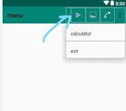

Next we create an Options Menu, In res/layout  create a file named design and write below code.

        <?xml version="1.0" encoding="utf-8"?>
        <FrameLayout
        xmlns:android="http://schemas.android.com/apk/res/android"
        android:layout_width="wrap_content"
        android:layout_height="wrap_content"
        android:padding="10dp"
        android:clipToPadding="false"
        android:focusable="true">
        
            <ImageView
                android:layout_width="wrap_content"
                android:layout_height="wrap_content"
                android:src="@drawable/cart"
                android:id="@+id/image"
                android:layout_gravity="center"
               />
        
            <TextView
                android:layout_width="18dp"
                android:text="3"
                android:id="@+id/badge"
                android:textStyle="bold"
                android:layout_gravity="top|end"
                android:textColor="#2196F3"
                android:background="@drawable/shape1"
                android:layout_marginTop="-4dp"
                android:layout_marginEnd="-4dp"
                android:gravity="center"
                android:textSize="11sp"
                android:layout_height="18dp"/>
        
        </FrameLayout>

Then is res/menu, Create a file named main.xml and write below code, this code code Put the design.xml on the Options Menu.

    <?xml version="1.0" encoding="utf-8"?>
    <menu xmlns:android="http://schemas.android.com/apk/res/android"
        xmlns:app="http://schemas.android.com/apk/res-auto">
        <item
            android:id="@+id/mycart"
            app:showAsAction="always"
            android:title="My Cart"
            android:actionLayout="@layout/design"
    
            />
    </menu>

This is how it Looks Like

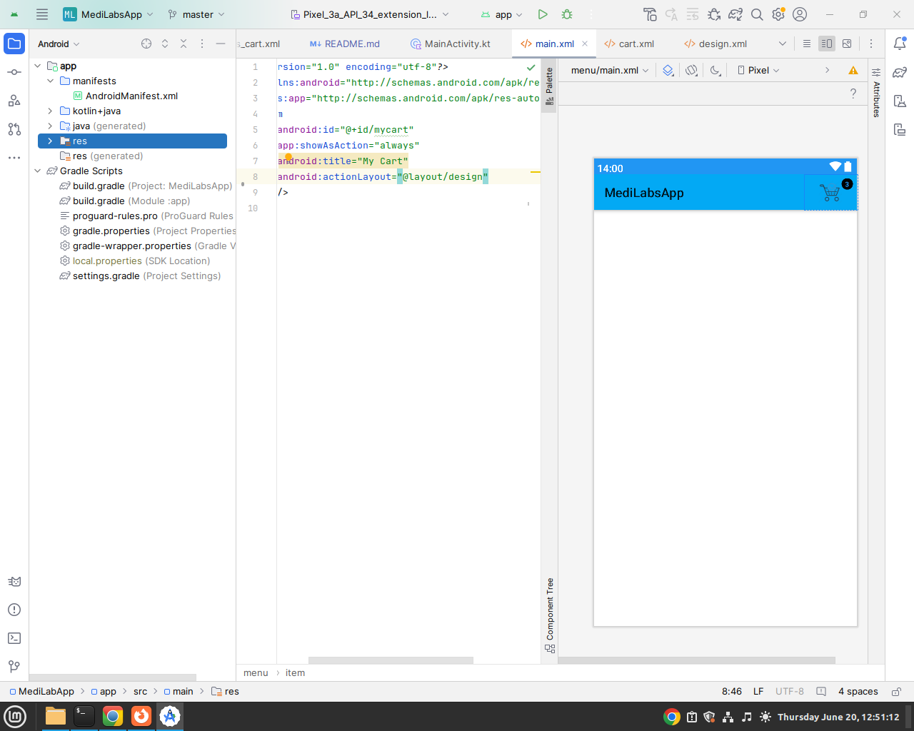

### Step 6
We need to make the shopping Cart icon on the options menu, Clickable and Link to MyCart Activity.
in MainActivity.kt add this function.
    
       override fun onCreateOptionsMenu(menu: Menu?): Boolean {
            menuInflater.inflate(R.menu.main, menu) // Access main.xml
            val item: MenuItem = menu!!.findItem(R.id.mycart) //find my cart item
            item.setActionView(R.layout.design) //load the design
            val actionView: View? = item.actionView

            //Access the views in design XML
            val number = actionView?.findViewById<TextView>(R.id.badge)
            val image = actionView?.findViewById<ImageView>(R.id.image)
            //If image is clicked, Link to MyCart
            image?.setOnClickListener {
                startActivity(Intent(applicationContext, MyCart::class.java))
            }
            //load the number of items in Cart icon
            val helper = SQLiteCartHelper(applicationContext)
            number?.text = ""+helper.getNumItems()
            return super.onCreateOptionsMenu(menu) //show options menu
        }

Run Your Application and Observe the shopping Cart icon on Options menu. Click on it and it Takes you to MyCart

   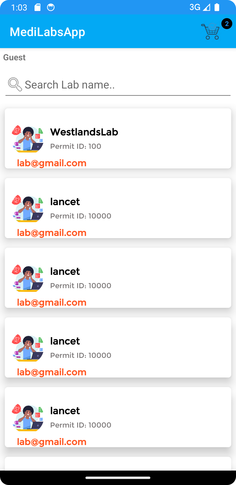 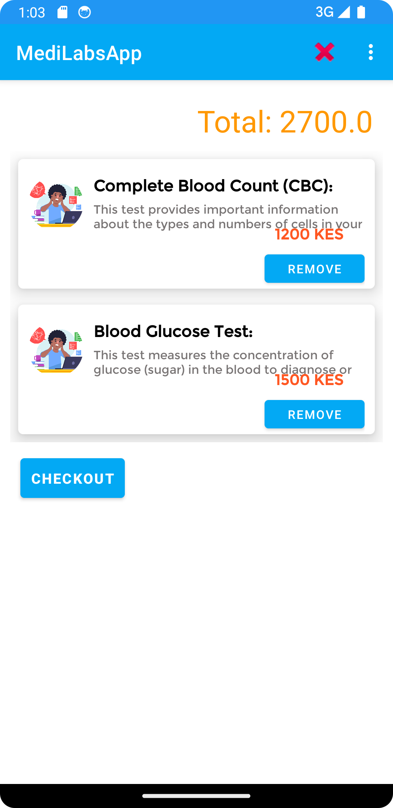  

Next Steps is to Make sure that when a user is in MyCart Activity and Clicks on the Back button , they are directed back to MainActivity.
Add below function in MyCart Activity.

       override fun onBackPressed() {
            val i = Intent(applicationContext, MainActivity::class.java)
            startActivity(i)
            finishAffinity()
       }

finishAffinity()    - This Clears the running/Open Activities(including MyCart) and Goes back to MainActivity.

### Step 7
Now your Cart is Ready. To finalize the Cart, We need to add Clear All Items and remove One Item from the cart.

We will do these functionalities in our MyCart Activity - Options Menu

In res/menu, Create a File named cart.xml, and write below code.

    <?xml version="1.0" encoding="utf-8"?>
    <menu xmlns:android="http://schemas.android.com/apk/res/android"
        xmlns:app="http://schemas.android.com/apk/res-auto">
       <item
           android:id="@+id/clearcart"
           app:showAsAction="always"
           android:title="Clear Cart"
           android:icon="@android:drawable/ic_delete"/>
    
        <item
            android:id="@+id/backtoLabs"
            app:showAsAction="never"
            android:title="Back"
            />
    
        <item
            android:id="@+id/login"
            app:showAsAction="never"
            android:title="Login"
            />
    
    </menu>

Above code creates an Options Menu Like below

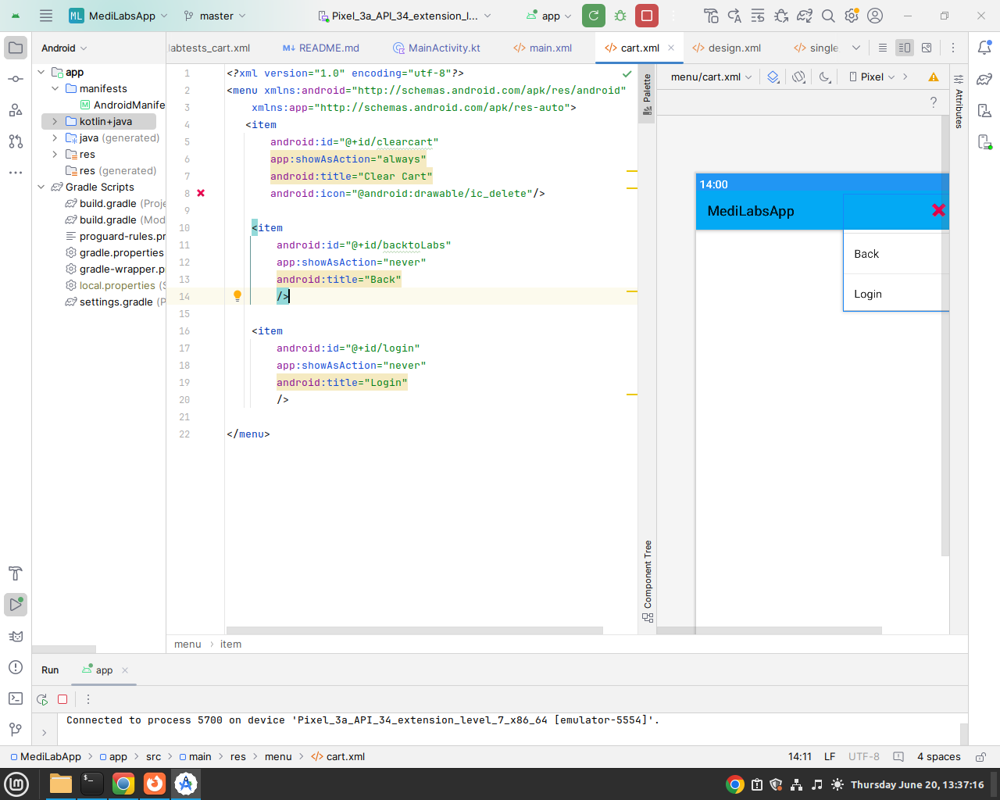

In MyCart.kt add below function that Loads the Options Menu in the Tool Bar.

       //Activate Options menu
        override fun onCreateOptionsMenu(menu: Menu?): Boolean {
            //Below code Loads the cart XML
            menuInflater.inflate(R.menu.cart, menu)
            return super.onCreateOptionsMenu(menu) //Creates an Options Menu
        }

Then add below functions to make the Options Menu Clickable.

           override fun onOptionsItemSelected(item: MenuItem): Boolean {
                //Below code makes id clear cart clickablea and clears the cart using helper.clearCart()
                if (item.itemId == R.id.clearcart){
                    val helper = SQLiteCartHelper(applicationContext)
                    helper.clearCart()
                }
                //backtoLabs takes us back to MainActivity
                if (item.itemId == R.id.backtoLabs){
                    startActivity(Intent(applicationContext, MainActivity::class.java))
                }
        
                return super.onOptionsItemSelected(item)
            }

Go to SQLiteHelper and reload the MyCart Activity in clearCart() fun.

        //Clear all records
        fun clearCart(){
            val db = this.writableDatabase
            db.delete("cart", null, null)
            println("Cart Cleared")
            Toast.makeText(context, "Cart Cleared", Toast.LENGTH_SHORT).show()
            //Reload the MyCart Activity
            val i = Intent(context, MyCart::class.java)
            i.flags = Intent.FLAG_ACTIVITY_NEW_TASK
            context.startActivity(i)
        } //end

Run Your Project.  Clear the Cart Using the the Options menu with icon (X).

     

### Step 8
Finally, We do the remove individual items from the Cart.
In adapters Package, Open LabTestsCartAdapter.kt, in onBindViewHolder Update the remove Button Click Listener as below

            val remove = holder.itemView.findViewById<MaterialButton>(R.id.remove)
            remove.setOnClickListener {
                //Get the clicked item ID
                val test_id = item.test_id
                //Access helper and provide the id to clearCartById() function
                val helper = SQLiteCartHelper(context)
                helper.clearCartById(test_id)
                //The Item is Removed.
                //Go to Helper and reload the MyCart Activity in clearCartById fun
            }

Go to SQLiteHelper and reload the MyCart Activity in clearCartById() fun.
          
         //Remove One Item
         fun clearCartById(test_id: String){
               val db = this.writableDatabase
               //Provide the test_id when deleting
               db.delete("cart", "test_id=?", arrayOf(test_id))
                println("Item Id $test_id Removed")
                Toast.makeText(context, "Item Id $test_id Removed", Toast.LENGTH_SHORT).show()
                //Reload the MyCart Activity
                val i = Intent(context, MyCart::class.java)
                i.flags = Intent.FLAG_ACTIVITY_NEW_TASK
                context.startActivity(i)
        }//end

Now you can run the App and Observe the Complete shopping Cart!

      

## Part 4
In the Previous part, we have seen how the shopping Cart works, In this Part, we will do a Registration Page to Sign Up user of our application  
The sign up is necessary in this app because users need to create an account before they Checkout.
 
### Step 1
In Main Package, Create an activity named SignUpActivity.  
In res/layout/activity_sign_up.xml write below code

       <?xml version="1.0" encoding="utf-8"?>
        <ScrollView
        xmlns:android="http://schemas.android.com/apk/res/android"
        xmlns:app="http://schemas.android.com/apk/res-auto"
        xmlns:tools="http://schemas.android.com/tools"
        android:layout_width="match_parent"
        android:layout_height="match_parent">
        
        <LinearLayout
        android:layout_width="match_parent"
        android:orientation="vertical"
        android:layout_margin="10dp"
        android:layout_height="match_parent"
        tools:context=".SignUpActivity">
        <com.google.android.material.textview.MaterialTextView
        android:layout_width="wrap_content"
        android:layout_height="wrap_content"
        android:text="Create an Account"
        android:textStyle="bold"
        android:textSize="30sp"
        android:fontFamily="@font/montserrat"
        android:textColor="@color/black"
        />
        
               <com.google.android.material.textfield.TextInputLayout
                   android:layout_width="match_parent"
                   android:layout_height="wrap_content"
                   android:layout_marginTop="10dp"
                   android:hint="Your Surname">
        
                   <com.google.android.material.textfield.TextInputEditText
                       android:layout_width="match_parent"
                       android:layout_height="wrap_content"
                       android:inputType="textPersonName"
                       android:id="@+id/surname"/>
        
               </com.google.android.material.textfield.TextInputLayout>
        
            <com.google.android.material.textfield.TextInputLayout
                android:layout_width="match_parent"
                android:layout_height="wrap_content"
                android:layout_marginTop="10dp"
                android:hint="Your Others">
        
                <com.google.android.material.textfield.TextInputEditText
                    android:layout_width="match_parent"
                    android:layout_height="wrap_content"
                    android:inputType="textPersonName"
                    android:id="@+id/others"/>
        
            </com.google.android.material.textfield.TextInputLayout>
        
            <com.google.android.material.textfield.TextInputLayout
                android:layout_width="match_parent"
                android:layout_height="wrap_content"
                android:layout_marginTop="10dp"
                android:hint="Your Email">
        
                <com.google.android.material.textfield.TextInputEditText
                    android:layout_width="match_parent"
                    android:layout_height="wrap_content"
                    android:inputType="textEmailAddress"
                    android:id="@+id/email"/>
        
            </com.google.android.material.textfield.TextInputLayout>
        
        
            <com.google.android.material.textfield.TextInputLayout
                android:layout_width="match_parent"
                android:layout_height="wrap_content"
                android:layout_marginTop="10dp"
                android:hint="Your Phone">
                <com.google.android.material.textfield.TextInputEditText
                    android:layout_width="match_parent"
                    android:layout_height="wrap_content"
                    android:inputType="phone"
                    android:id="@+id/phone"/>
            </com.google.android.material.textfield.TextInputLayout>
        
        
            <com.google.android.material.textfield.TextInputLayout
                android:layout_width="match_parent"
                android:layout_height="wrap_content"
                android:layout_marginTop="10dp"
                android:hint="Your Password">
        
                <com.google.android.material.textfield.TextInputEditText
                    android:layout_width="match_parent"
                    android:layout_height="wrap_content"
                    android:inputType="textPassword"
                    android:id="@+id/password"/>
        
            </com.google.android.material.textfield.TextInputLayout>
        
            <com.google.android.material.textfield.TextInputLayout
                android:layout_width="match_parent"
                android:layout_height="wrap_content"
                android:layout_marginTop="10dp"
                android:hint="Confirm Password">
        
                <com.google.android.material.textfield.TextInputEditText
                    android:layout_width="match_parent"
                    android:layout_height="wrap_content"
                    android:inputType="textPassword"
                    android:id="@+id/confirm"/>
        
            </com.google.android.material.textfield.TextInputLayout>
        
            <RadioGroup
                android:id="@+id/radioGroupGender"
                android:layout_width="wrap_content"
                android:layout_height="wrap_content"
                android:orientation="horizontal">
                <com.google.android.material.radiobutton.MaterialRadioButton
                    android:id="@+id/radioMale"
                    android:layout_width="wrap_content"
                    android:layout_height="wrap_content"
                    android:text="Male"
                    />
                <com.google.android.material.radiobutton.MaterialRadioButton
                    android:id="@+id/radioFemale"
                    android:layout_width="wrap_content"
                    android:layout_height="wrap_content"
                    android:text="Female"
                    />
            </RadioGroup>
        
            <LinearLayout
            android:layout_width="match_parent"
            android:layout_height="wrap_content"
            android:orientation="horizontal">
            <com.google.android.material.button.MaterialButton
            android:layout_width="wrap_content"
            android:layout_height="wrap_content"
            android:text="DOB"
            android:id="@+id/buttonDatePicker"/>
            
                <EditText
                    android:layout_width="match_parent"
                    android:layout_height="wrap_content"
                    android:hint="Date here"
                    android:enabled="false"
                    android:id="@+id/editTextDate"/>
            </LinearLayout>
            
            <!--spinner-->
                <LinearLayout
                    android:layout_width="match_parent"
                    android:layout_height="match_parent"
                    android:orientation="vertical"
                    android:padding="16dp">
            
                    <Spinner
                        android:id="@+id/spinner"
                        android:layout_width="match_parent"
                        android:layout_height="wrap_content" />
            
                    <TextView
                        android:id="@+id/selectedItemText"
                        android:layout_width="wrap_content"
                        android:layout_height="wrap_content"
                        android:text="Selected Item: " />
            
                </LinearLayout>
            
            
                <com.google.android.material.button.MaterialButton
                    android:layout_width="wrap_content"
                    android:layout_height="wrap_content"
                    android:text="Create Account"
                    android:id="@+id/create"/>
            
                <com.google.android.material.textview.MaterialTextView
                    android:layout_width="match_parent"
                    android:layout_height="wrap_content"
                    android:text="Already have an Account, Login"
                    android:padding="20dp"
                    android:textStyle="bold"
                    android:textColor="#3F51B5"
                    android:id="@+id/linktologin"/>
            
            </LinearLayout>
        </ScrollView>

### Step 2
In SignUpActivity.kt, write below code.

        package com.modcom.medilabsapp
        import android.app.DatePickerDialog
        import android.content.Intent
        import androidx.appcompat.app.AppCompatActivity
        import android.os.Bundle
        import android.view.View
        import android.widget.*
        import com.google.android.material.button.MaterialButton
        import com.google.android.material.textfield.TextInputEditText
        import com.google.android.material.textview.MaterialTextView
        import com.google.gson.GsonBuilder
        import com.modcom.medilabsapp.constants.Constants
        import com.modcom.medilabsapp.helpers.ApiHelper
        import com.modcom.medilabsapp.models.Locations
        import org.json.JSONArray
        import org.json.JSONObject
        import java.text.SimpleDateFormat
        import java.util.*
        
        class SignUpActivity : AppCompatActivity() {
        private lateinit var buttonDatePicker: Button
        private lateinit var editTextDate: EditText
        private lateinit var spinner: Spinner
        private lateinit var selectedItemText: TextView
        private lateinit var locations: List<Locations>
        override fun onCreate(savedInstanceState: Bundle?) {
        super.onCreate(savedInstanceState)
        setContentView(R.layout.activity_sign_up)
        //link to Login while in Register.
        val linktologin = findViewById<MaterialTextView>(R.id.linktologin)
        linktologin.setOnClickListener {
        startActivity(Intent(applicationContext, SignInActivity::class.java))
        }
        
                buttonDatePicker = findViewById(R.id.buttonDatePicker)
                editTextDate = findViewById(R.id.editTextDate)
        
                buttonDatePicker.setOnClickListener {
                    //First create below function
                    showDatePickerDialog()
                }//end onclick
        
                //Spinner
                spinner = findViewById(R.id.spinner)
                selectedItemText = findViewById(R.id.selectedItemText)
                // Sample data for the spinner
        
                //Fetch Locations and Bring them here
                val helper = ApiHelper(applicationContext)
                val body = JSONObject()
                //Access the /locations End point
                val api = Constants.BASE_URL+"/locations"
                helper.post(api, body,object: ApiHelper.CallBack{
                    override fun onSuccess(result: JSONArray?) {
                        //JSON Array Is Returned - Locations
                            // Convert JSONArray to ArrayList<Locations>
                            val gson = GsonBuilder().create()
                            locations = gson.fromJson(result.toString(),
                                Array<Locations>::class.java).toList()
        
                        val locationNames = locations.map { it.location }
        
                        val adapter = ArrayAdapter(applicationContext,
                            android.R.layout.simple_spinner_item, locationNames)
                        // Specify the layout to use when the list of choices appears
                        adapter.setDropDownViewResource(android.R.layout.simple_spinner_dropdown_item)
                        // Set the adapter to the spinner
                        spinner.adapter = adapter
                    }
        
                    override fun onSuccess(result: JSONObject?) {
                       //JSON Object for No Locations
        
                    }
        
                    override fun onFailure(result: String?) {
        
                    }
                })//end
                //val data: List<String> = listOf("1", "2", "3", "4", "5")// pending
                // Create an ArrayAdapter using the sample data
        
                //Check the selected location
                var location_id = ""
                spinner.onItemSelectedListener = object :AdapterView.OnItemSelectedListener{
                    override fun onItemSelected(p0: AdapterView<*>?, p1: View?, position: Int, p3: Long) {
                        val selectedLocation = locations[position]
                        location_id = selectedLocation.location_id
                    }
        
                    override fun onNothingSelected(p0: AdapterView<*>?) {
                        Toast.makeText(applicationContext,
                            "Please Select a location", Toast.LENGTH_SHORT).show()
                    }
                }//end
        
                val create = findViewById<MaterialButton>(R.id.create)
                create.setOnClickListener {  //where do we close it?
                    //Push/Post data to APi.
                    val surname = findViewById<TextInputEditText>(R.id.surname)
                    val others = findViewById<TextInputEditText>(R.id.others)
                    val email = findViewById<TextInputEditText>(R.id.email)
                    val phone = findViewById<TextInputEditText>(R.id.phone)
                    val password = findViewById<TextInputEditText>(R.id.password)
                    val confirm = findViewById<TextInputEditText>(R.id.confirm)
                    val female = findViewById<RadioButton>(R.id.radioFemale)
                    val male = findViewById<RadioButton>(R.id.radioMale)
        
                    //handle radio buttons
                    var gender = "N/A"
                    if (female.isChecked) {
                        gender = "Female"
                    }
                    if (male.isChecked) {
                        gender = "Male"
                    }
                    //check if passwords are matching
                    if (password.text.toString() != confirm.text.toString()) {
                        Toast.makeText(
                            applicationContext, "Password Not Matching",
                            Toast.LENGTH_SHORT
                        ).show()
                    } else {
                        //Post data to /member_signup API
                        val api = Constants.BASE_URL+"/member_signup"
                        val helper = ApiHelper(applicationContext)
                        val body = JSONObject()
                        body.put("surname", surname.text.toString())
                        body.put("others", others.text.toString())
                        body.put("email", email.text.toString())
                        body.put("phone", phone.text.toString())
                        body.put("dob", editTextDate.text.toString())
                        body.put("password", password.text.toString())
                        body.put("gender", gender)
                        body.put("location_id", location_id)
                        body.put("status", "TRUE")
        
        
                        helper.post(api, body, object : ApiHelper.CallBack {
                            override fun onSuccess(result: JSONArray?) {
                            }
        
                            override fun onSuccess(result: JSONObject?) {
                                //Posted successfully
                                Toast.makeText(applicationContext, result.toString(),
                                    Toast.LENGTH_SHORT).show()
                            }
        
                            override fun onFailure(result: String?) {
                                //Failed to post
                                Toast.makeText(applicationContext, result.toString(),
                                    Toast.LENGTH_SHORT).show()
                            }
                        });
        
                    }//end
                }//here inside oncreate, closes on click
            }//end oncreate
        
            //other functions- Date Picker function
            private fun showDatePickerDialog() {
                val calendar = Calendar.getInstance()
                // Create a date picker dialog and set the current date as the default selection
                val datePickerDialog = DatePickerDialog(
                    this,
                    { _: DatePicker, year: Int, month: Int, day: Int ->
                        val selectedDate = formatDate(year, month, day)
                        editTextDate.setText(selectedDate)
                    },
                    calendar.get(Calendar.YEAR),
                    calendar.get(Calendar.MONTH),
                    calendar.get(Calendar.DAY_OF_MONTH)
                )
                // Show the date picker dialog, user cannot pick tomorrow
                datePickerDialog.datePicker.maxDate = System.currentTimeMillis() - 568080000000;
                datePickerDialog.show()
            }
        
            //Date conversion
            private fun formatDate(year: Int, month: Int, day: Int): String {
                val calendar = Calendar.getInstance()
                calendar.set(year, month, day)
                val dateFormat = SimpleDateFormat("yyyy-MM-dd", Locale.getDefault())
                return dateFormat.format(calendar.time)
            }
        }//end class
        

Test Your Sign Up Activity.

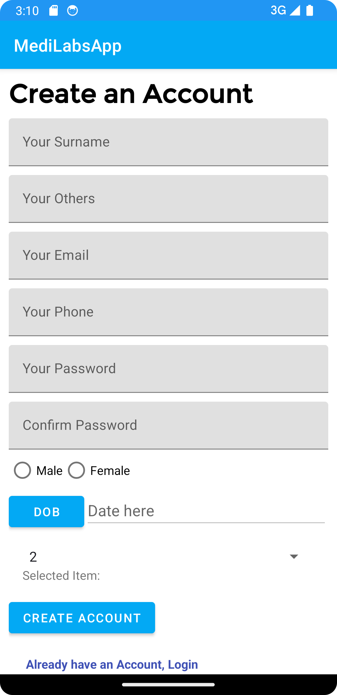

### Step 3
Before doing the SIgnInActivity, we will need to use shared prefferences to store our user data.
In helpers package, Create a Kotlin Class File named PrefsHelper.kt and write below code 

        package com.modcom.medilabsapp.helpers

        import android.content.Context
        import android.content.SharedPreferences
        import android.content.SharedPreferences.Editor
        
        //Shared preferences are used to values in a Key - value Approach
        class PrefsHelper {
        companion object{
                //Save to Preferences
                fun savePrefs(context: Context, key: String, value:String){
                    val pref: SharedPreferences = context.getSharedPreferences("store",
                    Context.MODE_PRIVATE)
                    val editor = pref.edit()
                    editor.putString(key, value)
                    editor.apply()
                }//end save
        
                //Get from Preferences
                fun getPrefs(context: Context, key: String) : String{
                    val pref: SharedPreferences = context.getSharedPreferences("store",
                        Context.MODE_PRIVATE)
                    val value = pref.getString(key, "")//key is empty or not exist return empty
                    return value.toString()
                }//end get
        
                //Remove an Item from Preferences
                fun clearPrefsByKey(context: Context, key: String){
                    val pref: SharedPreferences = context.getSharedPreferences("store",
                        Context.MODE_PRIVATE)
                    val editor = pref.edit()
                    editor.remove(key)
                    editor.apply()
                }//end
        
                //Clear All from Preferences
                fun clearPrefs(context: Context){
                    val pref: SharedPreferences = context.getSharedPreferences("store",
                        Context.MODE_PRIVATE)
                    val editor = pref.edit()
                    editor.clear()
                    editor.apply()
                }
        
            }//end companion
        }//end class

Above Helper will be used to Save, Get and Delete data from Shared Preferences

### Step 4
Next we do the sign in Activity.
In Main Package, Create a New Empty Views Activity named SignInActivity.kt

in res/layout/activity_sign_in.xml write below code.
        
            <?xml version="1.0" encoding="utf-8"?>
            <ScrollView
            xmlns:android="http://schemas.android.com/apk/res/android"
            xmlns:app="http://schemas.android.com/apk/res-auto"
            xmlns:tools="http://schemas.android.com/tools"
            android:layout_width="match_parent"
            android:layout_height="match_parent">
            
                <LinearLayout
                    android:layout_width="match_parent"
                    android:orientation="vertical"
                    android:layout_margin="10dp"
                    android:layout_height="match_parent"
                    tools:context=".SignInActivity">
                    <com.google.android.material.textview.MaterialTextView
                        android:layout_width="wrap_content"
                        android:layout_height="wrap_content"
                        android:text="Login Account"
                        android:textStyle="bold"
                        android:textSize="30sp"
                        android:fontFamily="@font/montserrat"
                        android:textColor="@color/black"
                        />
            
                    <com.google.android.material.textfield.TextInputLayout
                        android:layout_width="match_parent"
                        android:layout_height="wrap_content"
                        android:layout_marginTop="10dp"
                        android:hint="Your Surname">
            
                        <com.google.android.material.textfield.TextInputEditText
                            android:layout_width="match_parent"
                            android:layout_height="wrap_content"
                            android:inputType="textPersonName"
                            android:id="@+id/surname"/>

                    </com.google.android.material.textfield.TextInputLayout>
            
            
            
                    <com.google.android.material.textfield.TextInputLayout
                        android:layout_width="match_parent"
                        android:layout_height="wrap_content"
                        android:layout_marginTop="10dp"
                        android:hint="Your Password">
            
                        <com.google.android.material.textfield.TextInputEditText
                            android:layout_width="match_parent"
                            android:layout_height="wrap_content"
                            android:inputType="textPassword"
                            android:id="@+id/password"/>
            
                    </com.google.android.material.textfield.TextInputLayout>
            
            
            
                    <com.google.android.material.button.MaterialButton
                        android:layout_width="wrap_content"
                        android:layout_height="wrap_content"
                        android:text="Login Account"
                        android:id="@+id/login"/>
            
                    <com.google.android.material.textview.MaterialTextView
                        android:layout_width="match_parent"
                        android:layout_height="wrap_content"
                        android:text="Don't have an Account, Create"
                        android:padding="20dp"
                        android:textStyle="bold"
                        android:textColor="#3F51B5"
                        android:id="@+id/linktoregister"/>
            
                </LinearLayout>
            </ScrollView>

In SignInActivity.kt write below login code.

            package com.modcom.medilabsapp

            import android.content.Intent
            import androidx.appcompat.app.AppCompatActivity
            import android.os.Bundle
            import android.widget.Toast
            import com.google.android.material.button.MaterialButton
            import com.google.android.material.textfield.TextInputEditText
            import com.google.android.material.textview.MaterialTextView
            import com.modcom.medilabsapp.constants.Constants
            import com.modcom.medilabsapp.helpers.ApiHelper
            import com.modcom.medilabsapp.helpers.PrefsHelper
            import org.json.JSONArray
            import org.json.JSONObject
            
            class SignInActivity : AppCompatActivity() {
            override fun onCreate(savedInstanceState: Bundle?) {
            super.onCreate(savedInstanceState)
            setContentView(R.layout.activity_sign_in)
            
                    //link to register while in Login.
                    val linktoregister = findViewById<MaterialTextView>(R.id.linktoregister)
                    linktoregister.setOnClickListener {
                        startActivity(Intent(applicationContext, SignUpActivity::class.java))
                    }
            
                    //Find Views
                    val surname = findViewById<TextInputEditText>(R.id.surname)
                    val password = findViewById<TextInputEditText>(R.id.password)
            
                    val login = findViewById<MaterialButton>(R.id.login)
                    login.setOnClickListener {
                        //Specify the /member_signin" Endpoint
                        val api = Constants.BASE_URL+"/member_signin"
                        val helper = ApiHelper(applicationContext)
                        //Create a JSON Object of email and Password
                        val body = JSONObject()
                        //Use Email Edit Text
                        body.put("email", surname.text.toString())
                        body.put("password", password.text.toString())
                        helper.post(api, body, object : ApiHelper.CallBack {
                            override fun onSuccess(result: JSONArray?) {
                            }
            
                            override fun onSuccess(result: JSONObject?) {
                                //Consume the JSON - access keys
                                //Check if access_token exist in response
                                if (result!!.has("access_token")){
                                    //Access token Found, Login Success
                                    //access the access token and member from the JSOn returned
                                    val access_token = result.getString("access_token")
                                    val member = result.getString("member")// {} Object user details
            
                                    //Toast a success message
                                    Toast.makeText(applicationContext, "Success",
                                        Toast.LENGTH_SHORT).show()
            
                                    //Save access Token to Shared Prefs
                                    PrefsHelper.savePrefs(applicationContext,
                                        "access_token", access_token)
            
                                    //convert member to an Object
                                    val memberObject = JSONObject(member)
                                    val member_id = memberObject.getString("member_id")
                                    val email = memberObject.getString("email")
                                    val surname = memberObject.getString("surname")
            
                                    //save member, member_id, email, surname to Shared Prefs
                                    PrefsHelper.savePrefs(applicationContext,
                                        "userObject", member)
            
                                    PrefsHelper.savePrefs(applicationContext,
                                        "member_id", member_id)
            
                                    PrefsHelper.savePrefs(applicationContext,
                                        "email", email)
            
                                    PrefsHelper.savePrefs(applicationContext,
                                        "surname", surname)
            
                                    //redirect to MainActivity upon successful Login
                                    startActivity(Intent(applicationContext, MainActivity::class.java))
                                    finishAffinity()
                                    
                                }
                                else {
                                    //No access token Found , Login Failed
                                    Toast.makeText(applicationContext, result.toString(),
                                        Toast.LENGTH_SHORT).show()
                                }
                            }
            
                            override fun onFailure(result: String?) {
                                //Fails to Connect
                                Toast.makeText(applicationContext, result.toString(),
                                    Toast.LENGTH_SHORT).show()
                            }
            
                        });
            
                    }//end listener
                }//end oncreate
            }//end class

To test the SignInActivity, Open MyCart Activity and handle The checkout button Listener Like Below

             checkout.setOnClickListener {
                //Using Prefs check if token exists
                 val token = PrefsHelper.getPrefs(applicationContext, "access_token")
                 if (token.isEmpty()){
                     //Token does not exist, meaning Not Logged In
                     Toast.makeText(applicationContext, "Not Logged In",
                         Toast.LENGTH_SHORT).show()
                     startActivity(Intent(applicationContext, SignInActivity::class.java))
                     finish()
                 }
                else {
                         //Token Exists, meaning Logged In we Go to Next step
                         startActivity(Intent(applicationContext, CheckoutStep1::class.java))
                         Toast.makeText(applicationContext, "Logged In", Toast.LENGTH_SHORT).show()
                     }
                }//end

Test Your SignInActivity. Add Items to shopping cart and press the Checkout Button  

## Step 5
Finally, we need to update the MainActivity to detect if user is logged or Not and Update the UI accordingly.
in activity_main.xml update by adding 3 more buttons namely sign in, signout, profile and a user TextView as shown below

        <?xml version="1.0" encoding="utf-8"?>
        <LinearLayout
        xmlns:android="http://schemas.android.com/apk/res/android"
        xmlns:app="http://schemas.android.com/apk/res-auto"
        xmlns:tools="http://schemas.android.com/tools"
        android:layout_width="match_parent"
        android:layout_height="match_parent"
        android:orientation="vertical"
        tools:context=".MainActivity">
        
            <com.google.android.material.textview.MaterialTextView
                android:layout_width="match_parent"
                android:layout_height="wrap_content"
                android:text="Guest"
                android:padding="5dp"
                android:id="@+id/user"
                android:textStyle="bold"/>
        
            <com.google.android.material.button.MaterialButton
                android:layout_width="wrap_content"
                android:layout_height="40dp"
                android:textSize="11sp"
                android:text="Sign In"
                android:layout_marginStart="5dp"
                android:id="@+id/signin"/>
        
            <com.google.android.material.button.MaterialButton
                android:layout_width="wrap_content"
                android:layout_height="40dp"
                android:textSize="11sp"
                android:text="Sign Out"
                android:layout_marginStart="5dp"
                android:id="@+id/signout"/>
        
            <com.google.android.material.button.MaterialButton
                android:layout_width="wrap_content"
                android:layout_height="40dp"
                android:textSize="11sp"
                android:text="Profile"
                android:layout_marginStart="5dp"
                android:id="@+id/profile"/>
        
        
            <EditText
                android:layout_width="match_parent"
                android:layout_height="wrap_content"
                android:hint="Search Lab name.."
                android:drawableStart="@android:drawable/ic_menu_search"
                android:layout_margin="5dp"
                android:id="@+id/etsearch"/>
            <ProgressBar
                android:layout_width="match_parent"
                android:layout_height="wrap_content"
                android:layout_margin="3dp"
                android:id="@+id/progress"/>
        
        
        <androidx.swiperefreshlayout.widget.SwipeRefreshLayout
        android:layout_width="match_parent"
        android:layout_height="wrap_content"
        android:id="@+id/swipeRefreshLayout">
        
            <androidx.recyclerview.widget.RecyclerView
                android:id="@+id/recycler"
                android:layout_width="match_parent"
                android:layout_height="match_parent"
                tools:listitem="@layout/single_lab"/>
        
        </androidx.swiperefreshlayout.widget.SwipeRefreshLayout>

        </LinearLayout>

Then in MainActivity.kt add the following function

             fun update(){
                     //Find Views By ID
                     val user = findViewById<MaterialTextView>(R.id.user)
                     val signin = findViewById<MaterialButton>(R.id.signin)
                     val signout = findViewById<MaterialButton>(R.id.signout)
                     val profile = findViewById<MaterialButton>(R.id.profile)
                     
                     //Set below 3 Views to GONE/Disappear
                     signin.visibility = View.GONE
                     signout.visibility = View.GONE
                     profile.visibility = View.GONE
            
                     //Access user access token from Prefs
                     val token = PrefsHelper.getPrefs(applicationContext, "access_token")
                     if (token.isEmpty()){
                         //If user Token does  not exist, Update user TextView with Not Logged In
                         user.text = "Not Logged In"
                         //Make sign in button visible
                         signin.visibility = View.VISIBLE
                         signin.setOnClickListener {
                             //Link to Sign in Activity
                             startActivity(Intent(applicationContext, SignInActivity::class.java))
                         }
                     }
                     else{
                         //If user Token  exist, 
                         //Make Profile Button visible
                         profile.visibility = View.VISIBLE
                         profile.setOnClickListener {
                             //Link to Member Profile TODO Later
                            startActivity(Intent(applicationContext, MemberProfile::class.java))
                         }//end
                         
                         //Access username from Prefs
                         val surname = PrefsHelper.getPrefs(applicationContext, "surname")
                         //Update user textView with Logged in User
                         user.text = "Welcome $surname"
                         //Make signout button visble
                         signout.visibility = View.VISIBLE
                         //Link to PrefHelper and Clear Prefs
                         signout.setOnClickListener{
                             PrefsHelper.clearPrefs(applicationContext)
                             startActivity(intent)
                             finishAffinity()
                         }
                     }
             }//end

In the same file MainActivity.kt, under onCreate() Function, Call the Update Function like below.
            
            .....
            override fun onCreate(savedInstanceState: Bundle?) {
                super.onCreate(savedInstanceState)
                setContentView(R.layout.activity_main)

                update()
            .....

Run your application, Signin to the App and Observe the MainActivity.
 
Screenshot before Login 

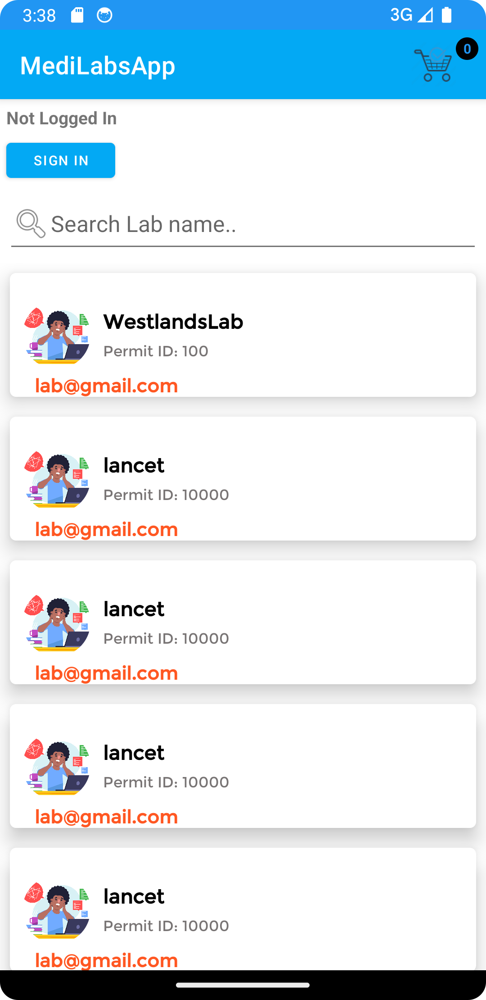

 
Screenshot after Login. 
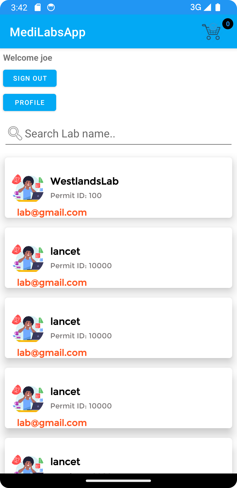

## Part 5
### Step 1
In this Part, we will create a MemberProfile section, This will include Viewing Logged in Member Details, Add Dependants and View Dependants.
 
In your main package, create a New Botton Navigation Activity, below is activity_member_profile.xml file 

        <?xml version="1.0" encoding="utf-8"?>
        <androidx.constraintlayout.widget.ConstraintLayout xmlns:android="http://schemas.android.com/apk/res/android"
            xmlns:app="http://schemas.android.com/apk/res-auto"
            android:id="@+id/container"
            android:layout_width="match_parent"
            android:layout_height="match_parent"
            android:paddingTop="?attr/actionBarSize">
        
            <com.google.android.material.bottomnavigation.BottomNavigationView
                android:id="@+id/nav_view"
                android:layout_width="0dp"
                android:layout_height="wrap_content"
                android:layout_marginStart="0dp"
                android:layout_marginEnd="0dp"
                android:background="?android:attr/windowBackground"
                app:layout_constraintBottom_toBottomOf="parent"
                app:layout_constraintLeft_toLeftOf="parent"
                app:layout_constraintRight_toRightOf="parent"
                app:menu="@menu/bottom_nav_menu" />
        
            <fragment
                android:id="@+id/nav_host_fragment_activity_member_profile"
                android:name="androidx.navigation.fragment.NavHostFragment"
                android:layout_width="match_parent"
                android:layout_height="match_parent"
                app:defaultNavHost="true"
                app:layout_constraintBottom_toTopOf="@id/nav_view"
                app:layout_constraintLeft_toLeftOf="parent"
                app:layout_constraintRight_toRightOf="parent"
                app:layout_constraintTop_toTopOf="parent"
                app:navGraph="@navigation/mobile_navigation" />
        
        </androidx.constraintlayout.widget.ConstraintLayout>

Below is the corresponding MemberProfile.kt code. Below code have 2 Bottom navigations represented by their IDs.     R.id.navigation_home, R.id.navigation_dependants  

        package com.modcom.medilabsapp
        import android.os.Bundle
        import com.google.android.material.bottomnavigation.BottomNavigationView
        import androidx.appcompat.app.AppCompatActivity
        import androidx.navigation.findNavController
        import androidx.navigation.ui.AppBarConfiguration
        import androidx.navigation.ui.setupActionBarWithNavController
        import androidx.navigation.ui.setupWithNavController
        import com.modcom.medilabsapp.databinding.ActivityMemberProfileBinding
        
        class MemberProfile : AppCompatActivity() {
        
            private lateinit var binding: ActivityMemberProfileBinding
        
            override fun onCreate(savedInstanceState: Bundle?) {
                super.onCreate(savedInstanceState)
                binding = ActivityMemberProfileBinding.inflate(layoutInflater)
                setContentView(binding.root)
        
                val navView: BottomNavigationView = binding.navView
        
                val navController = findNavController(R.id.nav_host_fragment_activity_member_profile)
                // Passing each menu ID as a set of Ids because each
                // menu should be considered as top level destinations.
                val appBarConfiguration = AppBarConfiguration(
                    setOf(
                        R.id.navigation_home, R.id.navigation_dependants
                    )
                )
                setupActionBarWithNavController(navController, appBarConfiguration)
                navView.setupWithNavController(navController)
            }
        }

in res/values/strings.xml you can update the Bottom Navigation titles linke below

        <resources>
            <string name="app_name">MediLabsApp</string>
            <string name="title_activity_member_profile">MemberProfile</string>
            <!-- Botton Navigation Titles-->
            <string name="title_home">Home</string>
            <string name="title_dependants">Dependants</string>
            <string name="title_notifications">Notifications</string>
            <!-- TODO: Remove or change this placeholder text -->
            <string name="hello_blank_fragment">Hello blank fragment</string>
        </resources>

Under **ui** package, Open HomeFragment.kt, here we will create the member profile, already we have the member details in the SharedPrefferences, we can retrieve them with below code and bind them in TextViews.

          val userObject = PrefsHelper.getPrefs(requireContext(), "userObject")

Below is the code for home fragment XML.

        <?xml version="1.0" encoding="utf-8"?>
        <LinearLayout
            xmlns:android="http://schemas.android.com/apk/res/android"
            xmlns:app="http://schemas.android.com/apk/res-auto"
            xmlns:tools="http://schemas.android.com/tools"
            android:layout_width="match_parent"
            android:orientation="vertical"
            android:layout_height="match_parent"
            tools:context=".ui.home.HomeFragment">
        
            <com.google.android.material.textview.MaterialTextView
                android:layout_width="match_parent"
                android:layout_height="wrap_content"
                android:text="My Profile"
                android:textSize="30sp"
                android:textAlignment="center"
                android:textStyle="bold"/>
            <com.google.android.material.textview.MaterialTextView
                android:layout_width="match_parent"
                android:layout_height="wrap_content"
                android:text="Jane"
                android:textSize="14sp"
                android:textAlignment="center"
                android:id="@+id/surname"
                android:textStyle="normal"/>
        
            <com.google.android.material.textview.MaterialTextView
                android:layout_width="match_parent"
                android:layout_height="wrap_content"
                android:text="Jane"
                android:textSize="14sp"
                android:textAlignment="center"
                android:id="@+id/others"
                android:textStyle="normal"/>
              <!--  TODO others-->
        
        </LinearLayout>

Below is the code for HomeFragment.kt. 

        package com.modcom.medilabsapp.ui.home
        import android.os.Bundle
        import android.view.LayoutInflater
        import android.view.View
        import android.view.ViewGroup
        import android.widget.TextView
        import androidx.fragment.app.Fragment
        import androidx.lifecycle.ViewModelProvider
        import com.google.android.material.textview.MaterialTextView
        import com.modcom.medilabsapp.databinding.FragmentHomeBinding
        import com.modcom.medilabsapp.helpers.PrefsHelper
        import org.json.JSONObject
        
        class HomeFragment : Fragment() {
        
            private var _binding: FragmentHomeBinding? = null
        
            // This property is only valid between onCreateView and
            // onDestroyView.
            private val binding get() = _binding!!
        
            override fun onCreateView(
                inflater: LayoutInflater,
                container: ViewGroup?,
                savedInstanceState: Bundle?
            ): View {
        
        
                _binding = FragmentHomeBinding.inflate(inflater, container, false)
                val root: View = binding.root
                //Code here
                val userObject = PrefsHelper.getPrefs(requireContext(), "userObject")
                val user = JSONObject(userObject) //convert to JSON Object
                //Text View 1
                val surname = _binding!!.surname  //find view
                surname.text = "Surname: "+ user.getString("surname")
                //Text View 2
                val others = _binding!!.others  //find view
                others.text = "Others: "+user.getString("others")
        
               //gender, dob, reg_date, email
        
        
        
                return root
            }
        
            override fun onDestroyView() {
                super.onDestroyView()
                _binding = null
            }
        }

NB: Above code is a Fragment not an Activity.   
Read more  https://developer.android.com/guide/fragments   
Below code accesses the XML

           _binding = FragmentHomeBinding.inflate(inflater, container, false)
           val root: View = binding.root

We also use requireContext(), as this is a Fragment. in Activities, we used getApplicationContext().  

To Link to MemberProfile from MainActivity, go to MainActivity under update() function, Put a listener to Profile Button and Intent to MemberProfile  
Check code commented with //  *************************

             fun update(){
                     //Find Views By ID
                     val user = findViewById<MaterialTextView>(R.id.user)
                     val signin = findViewById<MaterialButton>(R.id.signin)
                     val signout = findViewById<MaterialButton>(R.id.signout)
                     val profile = findViewById<MaterialButton>(R.id.profile)
                     
                     //Set below 3 Views to GONE/Disappear
                     signin.visibility = View.GONE
                     signout.visibility = View.GONE
                     profile.visibility = View.GONE
            
                     //Access user access token from Prefs
                     val token = PrefsHelper.getPrefs(applicationContext, "access_token")
                     if (token.isEmpty()){
                         //If user Token does  not exist, Update user TextView with Not Logged In
                         user.text = "Not Logged In"
                         //Make sign in button visible
                         signin.visibility = View.VISIBLE
                         signin.setOnClickListener {
                             //Link to Sign in Activity
                             startActivity(Intent(applicationContext, SignInActivity::class.java))
                         }
                     }
                     else{
                         //If user Token  exist, 
                         //Make Profile Button visible
                         profile.visibility = View.VISIBLE
                         //  *************************
                         profile.setOnClickListener {
                             //Link to Member Profile TODO Later
                            startActivity(Intent(applicationContext, MemberProfile::class.java))
                         }//end
                         
                         //Access username from Prefs
                         val surname = PrefsHelper.getPrefs(applicationContext, "surname")
                         //Update user textView with Logged in User
                         user.text = "Welcome $surname"
                         //Make signout button visble
                         signout.visibility = View.VISIBLE
                         //Link to PrefHelper and Clear Prefs
                         signout.setOnClickListener{
                             PrefsHelper.clearPrefs(applicationContext)
                             startActivity(intent)
                             finishAffinity()
                         }
                     }
             }//end

### Step 2
Above we did Profile in home fragment. Next we do Dependants(Add and View Dependants).  

In res/layout create a file named fragment_dependant.xml and write below form inputs, they include TextViews, EditTexts, RadioButton, Buttons, ScrollView etc.

        <?xml version="1.0" encoding="utf-8"?>
        <ScrollView
            xmlns:android="http://schemas.android.com/apk/res/android"
            xmlns:app="http://schemas.android.com/apk/res-auto"
            xmlns:tools="http://schemas.android.com/tools"
            android:layout_width="match_parent"
            android:layout_height="match_parent">
        
            <LinearLayout
                android:layout_width="match_parent"
                android:orientation="vertical"
                android:layout_margin="10dp"
                android:layout_height="match_parent"
                tools:context=".SignUpActivity">
                
                <com.google.android.material.button.MaterialButton
                    android:layout_width="match_parent"
                    android:layout_height="wrap_content"
                    android:text="My Dependants"
                    android:padding="10dp"
                    android:id="@+id/mydependants"/>
        
                <com.google.android.material.button.MaterialButton
                    android:layout_width="match_parent"
                    android:layout_height="wrap_content"
                    android:text="My Bookings"
                    android:padding="10dp"
                    android:background="@drawable/bg1"
                    android:id="@+id/mybookings"/>
                
                <com.google.android.material.textview.MaterialTextView
                    android:layout_width="wrap_content"
                    android:layout_height="wrap_content"
                    android:text="Add Dependant"
                    android:textStyle="bold"
                    android:textSize="30sp"
                    android:fontFamily="@font/montserrat"
                    android:textColor="@color/black"
                    />
        
                <com.google.android.material.textfield.TextInputLayout
                    android:layout_width="match_parent"
                    android:layout_height="wrap_content"
                    android:layout_marginTop="10dp"
                    android:hint="Your Surname">
        
                    <com.google.android.material.textfield.TextInputEditText
                        android:layout_width="match_parent"
                        android:layout_height="wrap_content"
                        android:inputType="textPersonName"
                        android:id="@+id/surname"/>
        
                </com.google.android.material.textfield.TextInputLayout>
        
                <com.google.android.material.textfield.TextInputLayout
                    android:layout_width="match_parent"
                    android:layout_height="wrap_content"
                    android:layout_marginTop="10dp"
                    android:hint="Your Others">
        
                    <com.google.android.material.textfield.TextInputEditText
                        android:layout_width="match_parent"
                        android:layout_height="wrap_content"
                        android:inputType="textPersonName"
                        android:id="@+id/others"/>
        
                </com.google.android.material.textfield.TextInputLayout>
        
        
                <RadioGroup
                    android:id="@+id/radioGroupGender"
                    android:layout_width="wrap_content"
                    android:layout_height="wrap_content"
                    android:orientation="horizontal">
                    <com.google.android.material.radiobutton.MaterialRadioButton
                        android:id="@+id/radioMale"
                        android:layout_width="wrap_content"
                        android:layout_height="wrap_content"
                        android:text="Male"
                        />
                    <com.google.android.material.radiobutton.MaterialRadioButton
                        android:id="@+id/radioFemale"
                        android:layout_width="wrap_content"
                        android:layout_height="wrap_content"
                        android:text="Female"
                        />
                </RadioGroup>
        
                <!--
                ChatGPT - click button and popup a calender put the
                date in Edittext android kotlin xml
                -->
                <LinearLayout
                    android:layout_width="match_parent"
                    android:layout_height="wrap_content"
                    android:orientation="horizontal">
                    <com.google.android.material.button.MaterialButton
                        android:layout_width="wrap_content"
                        android:layout_height="wrap_content"
                        android:text="DOB"
                        android:id="@+id/buttonDatePicker"/>
        
                    <EditText
                        android:layout_width="match_parent"
                        android:layout_height="wrap_content"
                        android:hint="Date here"
                        android:enabled="false"
                        android:id="@+id/editTextDate"/>
                </LinearLayout>
        
        
                <com.google.android.material.button.MaterialButton
                    android:layout_width="wrap_content"
                    android:layout_height="wrap_content"
                    android:text="Add Dependant"
                    android:background="@drawable/bg1"
                    android:id="@+id/adddependant"/>
        
        
            </LinearLayout>
        </ScrollView>

        
Under ui package, create a subpackage named dependants, Inside this subpackage, create a Kotlin Class File and write below code to get data from XML inputs and Post to our add_dependants API.

        package com.modcom.medilabsapp.ui.dependants
        import android.app.DatePickerDialog
        import android.content.Intent
        import android.os.Bundle
        import androidx.fragment.app.Fragment
        import android.view.LayoutInflater
        import android.view.View
        import android.view.ViewGroup
        import android.widget.*
        import androidx.core.app.ActivityCompat.finishAffinity
        import com.google.android.material.button.MaterialButton
        import com.google.android.material.textfield.TextInputEditText
        import com.modcom.medilabsapp.*
        import com.modcom.medilabsapp.constants.Constants
        import com.modcom.medilabsapp.helpers.ApiHelper
        import com.modcom.medilabsapp.helpers.PrefsHelper
        import org.json.JSONArray
        import org.json.JSONObject
        import java.text.SimpleDateFormat
        import java.util.*
        
        
        class DependantFragment : Fragment() {
            private lateinit var buttonDatePicker: Button
            private lateinit var editTextDate: EditText
            override fun onCreateView(
                inflater: LayoutInflater, container: ViewGroup?,
                savedInstanceState: Bundle?
            ): View? {
                // Inflate the layout for this fragment
                val root = inflater.inflate(R.layout.fragment_dependant, container, false)
                //Code here
                buttonDatePicker = root.findViewById(R.id.buttonDatePicker)
                editTextDate = root.findViewById(R.id.editTextDate)
                //Button Listener and call  showDatePickerDialog() - see this function at the end of this File.
                buttonDatePicker.setOnClickListener {
                    showDatePickerDialog()
                }//end onclick
        
                val mydependants  = root.findViewById<MaterialButton>(R.id.mydependants)
                mydependants.setOnClickListener {
                    // below Intent, to be activated once ViewDependants is created
                    // startActivity(Intent(requireContext(), ViewDependants::class.java))
                }
        
                val mybookings  = root.findViewById<MaterialButton>(R.id.mybookings)
                mybookings.setOnClickListener {
                    startActivity(Intent(requireContext(), MyBookings::class.java))
                }
        
                //post to API
                val adddependant = root.findViewById<MaterialButton>(R.id.adddependant)
                adddependant.setOnClickListener {
                    //Push/Post data to APi.
                    val surname = root.findViewById<TextInputEditText>(R.id.surname)
                    val others = root.findViewById<TextInputEditText>(R.id.others)
                    val female = root.findViewById<RadioButton>(R.id.radioFemale)
                    val male = root.findViewById<RadioButton>(R.id.radioMale)
                    //handle Radio Buttons
                    var gender = "N/A"
                    if (female.isSelected) {
                        gender = "Female"
                    }
                    if (male.isSelected) {
                        gender = "Male"
                    }
                    //Get member ID from Prefs
                    val member_id = PrefsHelper.getPrefs(requireContext(), "member_id")
                    //Access base URL
                    val api = Constants.BASE_URL+"/add_dependant"
                    val helper = ApiHelper(requireContext())
                    val body = JSONObject()
                    body.put("surname", surname.text.toString())
                    body.put("others", others.text.toString())
                    body.put("dob", editTextDate.text.toString())
                    body.put("gender", gender)
                    body.put("member_id", member_id)
                    helper.post(api, body, object : ApiHelper.CallBack {
                        override fun onSuccess(result: JSONArray?) {
                        }
        
                        override fun onSuccess(result: JSONObject?) {
                            //Dependants Saved
                            Toast.makeText(requireContext(), result.toString(),
                                Toast.LENGTH_SHORT).show()
                        }
        
                        override fun onFailure(result: String?) {
                            Toast.makeText(requireContext(),
                                result.toString(), Toast.LENGTH_SHORT).show()
                            val json = JSONObject(result.toString())
                            val msg = json.opt("msg")
                            //TODO
                            //If token is Expired redrect to SignIn and Clear Prefs
                            if (msg == "Token has Expired"){
                                PrefsHelper.clearPrefs(requireContext())
                                startActivity(Intent(requireContext(), SignInActivity::class.java))
                                finishAffinity(requireActivity())
                            }
                        }
                    });
        
                }//end listener
        
                return root
        
            }//end oncreate view
        
        
            //This is for launching the DatePicker.
            private fun showDatePickerDialog() {
                val calendar = Calendar.getInstance()
                // Create a date picker dialog and set the current date as the default selection
                val datePickerDialog = DatePickerDialog(
                    requireContext(),
                    { _: DatePicker, year: Int, month: Int, day: Int ->
                        val selectedDate = formatDate(year, month, day)
                        editTextDate.setText(selectedDate)
                    },
                    calendar.get(Calendar.YEAR),
                    calendar.get(Calendar.MONTH),
                    calendar.get(Calendar.DAY_OF_MONTH)
                )
                // Show the date picker dialog
                datePickerDialog.show()
            }
            private fun formatDate(year: Int, month: Int, day: Int): String {
                val calendar = Calendar.getInstance()
                calendar.set(year, month, day)
                val dateFormat = SimpleDateFormat("yyyy-MM-dd", Locale.getDefault())
                return dateFormat.format(calendar.time)
            }
        }//last brace, End Class
        
Above will help a member add a dependant.

### Step 3
This Step We Create a File to View dependants.
In res/layout create a file named single_dependant.xml and write below code.

        <?xml version="1.0" encoding="utf-8"?>
        <androidx.cardview.widget.CardView
            xmlns:app="http://schemas.android.com/apk/res-auto"
            xmlns:android="http://schemas.android.com/apk/res/android"
            android:layout_width="match_parent"
            android:layout_height="wrap_content"
            app:cardElevation="10dp"
            android:layout_margin="8dp"
            app:cardCornerRadius="5dp">
        
            <RelativeLayout
                android:layout_width="match_parent"
                android:layout_height="120dp">
        
                <de.hdodenhof.circleimageview.CircleImageView
                    android:id="@+id/labimage"
                    android:layout_width="55dp"
                    android:layout_height="55dp"
                    android:src="@drawable/screen1"
                    android:layout_centerVertical="true"
                    android:layout_marginLeft="10dp"/>
        
                <LinearLayout
                    android:id="@+id/linear1"
                    android:layout_width="wrap_content"
                    android:layout_height="wrap_content"
                    android:layout_centerVertical="true"
                    android:layout_toEndOf="@id/labimage"
                    android:orientation="vertical"
                    android:layout_marginLeft="10dp">
        
                    <com.google.android.material.textview.MaterialTextView
                        android:layout_width="wrap_content"
                        android:layout_height="wrap_content"
                        android:text="Ann"
                        android:textStyle="bold"
                        android:textSize="16sp"
                        android:fontFamily="@font/montserrat"
                        android:textColor="@color/black"
                        android:id="@+id/dep_name"/>
        
                    <com.google.android.material.textview.MaterialTextView
                        android:layout_width="wrap_content"
                        android:layout_height="wrap_content"
                        android:text="James"
                        android:textStyle="normal"
                        android:textSize="12sp"
                        android:maxLines="2"
                        android:fontFamily="@font/montserrat"
                        android:textColor="#787474"
                        android:layout_marginTop="6dp"
                        android:id="@+id/dep_others"/>
                </LinearLayout>
        
                <LinearLayout
                    android:layout_width="wrap_content"
                    android:layout_height="wrap_content"
                    android:layout_below="@id/linear1"
                    android:layout_marginTop="5dp"
                    android:layout_marginLeft="10dp"
                    android:layout_marginBottom="5dp"
                    android:orientation="vertical">
        
                    <com.google.android.material.textview.MaterialTextView
                        android:id="@+id/dep_dob"
                        android:layout_width="315dp"
                        android:layout_height="wrap_content"
                        android:fontFamily="@font/montserrat"
                        android:text="2022-02-08"
                        android:textAlignment="textEnd"
                        android:textColor="#FF5722"
                        android:textSize="15sp"
                        android:textStyle="bold" />
                </LinearLayout>
        
            </RelativeLayout>
        </androidx.cardview.widget.CardView>

in adapters, Create an adapter named DependantAdapter.kt and write below adapter.

        package com.modcom.medilabsapp.adapters
        import android.app.AlertDialog
        import android.content.Context
        import android.content.Intent
        import android.view.LayoutInflater
        import android.view.View
        import android.view.ViewGroup
        import android.widget.Toast
        import androidx.recyclerview.widget.RecyclerView
        import com.google.android.material.textview.MaterialTextView
        import com.modcom.medilabsapp.CheckoutStep2GPS
        import com.modcom.medilabsapp.LabTestsActivity
        import com.modcom.medilabsapp.R
        import com.modcom.medilabsapp.SingleLabTest
        import com.modcom.medilabsapp.helpers.PrefsHelper
        import com.modcom.medilabsapp.models.Dependant
        import com.modcom.medilabsapp.models.Lab
        import com.modcom.medilabsapp.models.LabTests
        
        
        class DependantAdapter(var context: Context):
            RecyclerView.Adapter<DependantAdapter.ViewHolder>() {
        
            //Create a List and connect it with our model
            var itemList : List<Dependant> = listOf() //Its empty
        
            //Create a Class here, will hold our views in single_lab xml
            inner class  ViewHolder(itemView: View):  RecyclerView.ViewHolder(itemView)
        
            override fun onCreateViewHolder(parent: ViewGroup, viewType: Int): DependantAdapter.ViewHolder {
                //access/inflate the single lab xml
                val view = LayoutInflater.from(parent.context).inflate(R.layout.single_dependant,
                    parent, false)
        
                return ViewHolder(view) //pass the single lab to ViewHolder
            }
        
            override fun onBindViewHolder(holder: DependantAdapter.ViewHolder, position: Int) {
                 //Find your 3 text views
                val dep_name = holder.itemView.findViewById<MaterialTextView>(R.id.dep_name)
                val dep_others = holder.itemView.findViewById<MaterialTextView>(R.id.dep_others)
                val dep_dob = holder.itemView.findViewById<MaterialTextView>(R.id.dep_dob)
                //Assume one Lab
                 val item = itemList[position]
                 dep_name.text = item.surname
                 dep_others.text = item.others
                 dep_dob.text = item.dob
                 holder.itemView.setOnClickListener {
               
                        
                 }//end Listner
            }//end bind
        
            override fun getItemCount(): Int {
                return itemList.size  //Count how may Items in the List
            }
        
            //This is for filtering data
            fun filterList(filterList: List<Dependant>){
                itemList = filterList
                notifyDataSetChanged()
            }
        
        
            //Earlier we mentioned item List is empty!
            //We will get data from our APi, then bring it to below function
            //The data you bring here must follow the Lab model
            fun setListItems(data: List<Dependant>){
                itemList = data //map/link the data to itemlist
                notifyDataSetChanged()
            //Tell this adapter class that now itemList is loaded with data
            }
        
        }

Next, in main package, create a new Empty Views Activity named ViewDependants.
in activity_view_dependants.xml  write below code for the Recycler View.

        <?xml version="1.0" encoding="utf-8"?>
        <LinearLayout
            xmlns:android="http://schemas.android.com/apk/res/android"
            xmlns:app="http://schemas.android.com/apk/res-auto"
            xmlns:tools="http://schemas.android.com/tools"
            android:layout_width="match_parent"
            android:layout_height="match_parent"
            android:orientation="vertical"
            tools:context=".ViewDependants">
        
            <EditText
                android:layout_width="match_parent"
                android:layout_height="wrap_content"
                android:hint="Search dependant.."
                android:drawableStart="@android:drawable/ic_menu_search"
                android:layout_margin="5dp"
                android:id="@+id/etsearch"/>
            <ProgressBar
                android:layout_width="match_parent"
                android:layout_height="wrap_content"
                android:layout_margin="3dp"
                android:id="@+id/progress"/>
        
        
            <androidx.swiperefreshlayout.widget.SwipeRefreshLayout
                android:layout_width="match_parent"
                android:layout_height="wrap_content"
                android:id="@+id/swipeRefreshLayout">
        
                <androidx.recyclerview.widget.RecyclerView
                    android:id="@+id/recycler"
                    android:layout_width="match_parent"
                    android:layout_height="match_parent"
                    tools:listitem="@layout/single_dependant"/>
        
            </androidx.swiperefreshlayout.widget.SwipeRefreshLayout>
        
        
        
        </LinearLayout>

Then in ViewDependants.kt write below code to load the data from the Adpater to our Recycler View

        package com.modcom.medilabsapp
        import android.content.Intent
        import androidx.appcompat.app.AppCompatActivity
        import android.os.Bundle
        import android.text.Editable
        import android.text.TextWatcher
        import android.util.Log
        import android.view.View
        import android.widget.EditText
        import android.widget.ProgressBar
        import android.widget.Toast
        import androidx.recyclerview.widget.LinearLayoutManager
        import androidx.recyclerview.widget.RecyclerView
        import androidx.swiperefreshlayout.widget.SwipeRefreshLayout
        import com.google.gson.GsonBuilder
        import com.modcom.medilabsapp.adapters.DependantAdapter
        import com.modcom.medilabsapp.adapters.LabTestsAdapter
        import com.modcom.medilabsapp.constants.Constants
        import com.modcom.medilabsapp.helpers.ApiHelper
        import com.modcom.medilabsapp.helpers.PrefsHelper
        import com.modcom.medilabsapp.models.Dependant
        import com.modcom.medilabsapp.models.LabTests
        import org.json.JSONArray
        import org.json.JSONObject
        
        class ViewDependants : AppCompatActivity() {
            lateinit var itemList: List<Dependant>
            lateinit var depAdapter: DependantAdapter
            lateinit var recyclerView: RecyclerView
            lateinit var progress: ProgressBar
            lateinit var swiperefresh: SwipeRefreshLayout
            override fun onCreate(savedInstanceState: Bundle?) {
                super.onCreate(savedInstanceState)
                setContentView(R.layout.activity_view_dependants)
        
                progress = findViewById(R.id.progress)
                recyclerView = findViewById(R.id.recycler)
                depAdapter = DependantAdapter(applicationContext)
                recyclerView.layoutManager = LinearLayoutManager(applicationContext)
                recyclerView.setHasFixedSize(true)
                post_fetch()
        
                swiperefresh = findViewById<SwipeRefreshLayout>(R.id.swipeRefreshLayout)
                swiperefresh.setOnRefreshListener {
                    post_fetch()// fetch data again
                }//end refresh
        
                //Filter labs
                val etsearch = findViewById<EditText>(R.id.etsearch)
                etsearch.addTextChangedListener(object: TextWatcher {
                    override fun beforeTextChanged(p0: CharSequence?, p1: Int, p2: Int, p3: Int) {
        
                    }
        
                    override fun onTextChanged(texttyped: CharSequence?, p1: Int, p2: Int, p3: Int) {
                        filter(texttyped.toString())
                    }
        
                    override fun afterTextChanged(p0: Editable?) {
        
                    }
        
                })
        
            }//end oncreate
        
            fun post_fetch(){
                val api = Constants.BASE_URL+"/view_dependants"
                //Above APi needs a Body, So we have to build it
                val body = JSONObject()
                //Retrieve the id from Prefs
                val member_id = PrefsHelper.getPrefs(applicationContext,"member_id")
                //provide the ID to the API
                body.put("member_id", member_id) //NB: 4 is static
                val helper = ApiHelper(applicationContext)
                helper.post(api, body, object : ApiHelper.CallBack{
                    override fun onSuccess(result: JSONArray?) {
                        val gson = GsonBuilder().create()
                        itemList = gson.fromJson(result.toString(),
                            Array<Dependant>::class.java).toList()
                        //Finally, our adapter has the data
                        depAdapter.setListItems(itemList)
                        //For the sake of recycling/Looping items, add the adapter to recycler
                        recyclerView.adapter = depAdapter
                        progress.visibility = View.GONE
                        swiperefresh.isRefreshing = false
                    }
                    override fun onSuccess(result: JSONObject?) {
                        Toast.makeText(applicationContext, result.toString(),
                            Toast.LENGTH_SHORT).show()
                        progress.visibility = View.GONE
                    }
        
                    override fun onFailure(result: String?) {
                        Toast.makeText(applicationContext, "Error:"+result.toString(),
                            Toast.LENGTH_SHORT).show()
                        //It returns a msg : Token Expired
                        val json = JSONObject(result.toString())
                        val msg = json.opt("msg")
                        //TODO
                        if (msg == "Token has Expired"){
                             PrefsHelper.clearPrefs(applicationContext)
                             startActivity(Intent(applicationContext, SignInActivity::class.java))
                            finishAffinity()
                        }
                        Log.d("failureerrors", result.toString())
                    }
                })
            }//end fetch
        
        
            private fun filter(text: String) {
                // creating a new array list to filter our data.
                val filteredlist: ArrayList<Dependant> = ArrayList()
                // running a for loop to compare elements.
                for (item in itemList) {
                    // checking if the entered string matched with any item of our recycler view.
                    if (item.surname.lowercase().contains(text.lowercase())) {
                        // if the item is matched we are
                        // adding it to our filtered list.
                        filteredlist.add(item)
                    }
                }
                if (filteredlist.isEmpty()) {
                    // if no item is added in filtered list we are
                    // displaying a toast message as no data found.
                    //Toast.makeText(this, "No Data Found..", Toast.LENGTH_SHORT).show()
                    depAdapter.filterList(filteredlist)
                } else {
                    // at last we are passing that filtered
                    // list to our adapter class.
                    depAdapter.filterList(filteredlist)
                }
            }
        
        }//end class

To Link to ViewDependants.kt from AddDependants, Recall in AddDependants XML there was a button for View Dependants, In AddDependants.kt Activity, Update with this Code

                val mydependants  = root.findViewById<MaterialButton>(R.id.mydependants)
                mydependants.setOnClickListener {
                    // Below Intent, Link to ViewDependants::class.java
                    startActivity(Intent(requireContext(), ViewDependants::class.java))
                }

Now Run your App, From the MainActivity, Click on Profile Button(You must be logged in). The Click on AddDependant Bottom Nav.  
Test Add Dependants and View Dependants.

