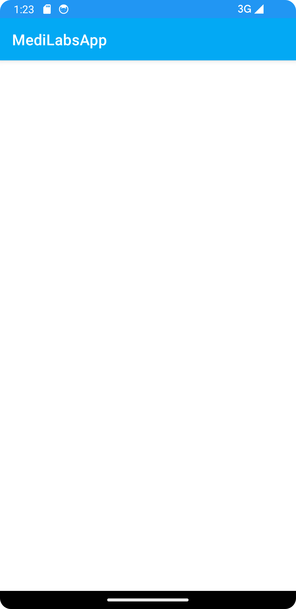

## Guide to MediLabApp
In this Guide, You will learn how to create an advanced mobile app, 
The application to be developed is an online Lab Tests Booking System which will allow patients book for specific Lab Tests form different Laboratories, 
it includes Authentication module, Services Listing, Shopping Cart Module, Maps and GPS Module, Fragments, Payment, APIs etc,
This app is inspired by Online Booking Apps such as Glovo, Uber Eats, Booking.com, Yum, Jumia Foods etc.

### Prerequisites
In order to develop this app, you must have an understanding of Kotlin Language and have Android Application Development Fundamentals.
 

This mobile application consumes an API in the backend, If you have not created the API, Please follow below link  
https://github.com/modcomlearning/medilab

### Part 1
#### Step 1 : App Structure
In this step we understand the app structure.
Create a New Android App. Use Empty Views Activity.

NB: Please use a different unique Package.  

In your app Package under Kotlin + Java, create four subpackages namely;  
adapters - To be used to store our Adapters used by Recycler Views 
constants - To be used in storing Constants variables that are used across the application  
helpers - To be used to hold helpers that help us with different functionalities in our App i.e APIHelper 
models - This package will store models that define the data we will be working on. 

in res Folder, create a subfolder named 'font' and place sample fonts inside.  
Download Fonts from here https://www.fontsquirrel.com/fonts/list/popular     

#### Creating the Start Screens, Screen1 and Screen2.
Right click your main package, Create a New Empty Views activity named Screen1 and another one named Screen2.
In drawable Folder place 2 images to be shown in screen1 and screen2  

In activity_screen1.xml Write below code.  
In below code, we have used an image stored in res/drawable and a font stored in res/fonts

        <?xml version="1.0" encoding="utf-8"?>
        <LinearLayout xmlns:android="http://schemas.android.com/apk/res/android"
        xmlns:app="http://schemas.android.com/apk/res-auto"
        xmlns:tools="http://schemas.android.com/tools"
        android:layout_width="match_parent"
        android:orientation="vertical"
        android:layout_height="match_parent"
        tools:context=".Screen1">
        
            <LinearLayout
                android:layout_width="match_parent"
                android:layout_height="wrap_content"
                android:orientation="horizontal"
                android:layout_marginRight="15dp"
                android:layout_marginTop="15dp"
                >
        
                <com.google.android.material.textview.MaterialTextView
                    android:id="@+id/skip1"
                    android:layout_width="match_parent"
                    android:layout_height="wrap_content"
                    android:text="Skip"
                    android:fontFamily="@font/montserrat"
                    android:textAlignment="textEnd"
                    android:textColor="#9F9797"
                    android:textStyle="bold"
                    android:textSize="15sp"/>
            </LinearLayout>
        
        
        
               <com.google.android.material.textview.MaterialTextView
                   android:layout_width="match_parent"
                   android:layout_height="wrap_content"
                   android:text="Book Your Lab"
                   android:textAlignment="textStart"
                   android:layout_marginTop="100dp"
                   android:fontFamily="@font/montserrat"
                   android:layout_marginLeft="15dp"
                   android:textColor="#353232"
                   android:textStyle="bold"
                   android:textSize="34sp"/>
        
            <com.google.android.material.textview.MaterialTextView
                android:layout_width="match_parent"
                android:layout_height="wrap_content"
                android:text="This is professional mobile onboarding screens.this screens useing on food delivery app."
                android:textAlignment="textStart"
                android:layout_marginTop="10dp"
                android:layout_marginLeft="15dp"
                android:fontFamily="@font/montserrat"
                android:textColor="#706E6E"
                android:textStyle="normal"
                android:lineHeight="20dp"
                android:textSize="14sp"/>
        
        
               <ImageView
                   android:layout_width="400dp"
                   android:layout_height="300dp"
                   android:src="@drawable/screen11"
                   android:padding="20dp"/>
        
        
            <androidx.coordinatorlayout.widget.CoordinatorLayout
                android:layout_width="match_parent"
                android:layout_height="match_parent">
                <com.google.android.material.floatingactionbutton.FloatingActionButton
                    android:id="@+id/fab"
                    android:layout_width="wrap_content"
                    android:layout_height="wrap_content"
                    android:layout_gravity="bottom|end"
                    android:layout_margin="10dp"
                    app:backgroundTint="#3F51B5" />
                <TextView
                    android:layout_height="wrap_content"
                    android:layout_width="wrap_content"
                    android:text="Next"
                    android:elevation="6dp"
                    android:textSize="18dp"
                    android:fontFamily="@font/montserrat"
                    android:textColor="#fff"
                    app:layout_anchor="@id/fab"
                    app:layout_anchorGravity="center"/>
            </androidx.coordinatorlayout.widget.CoordinatorLayout>
        
        </LinearLayout>

In Screen1.kt Write below code  

    package com.modcom.medilabsapp
    
    import android.content.Intent
    import androidx.appcompat.app.AppCompatActivity
    import android.os.Bundle
    import com.google.android.material.floatingactionbutton.FloatingActionButton
    import com.google.android.material.textview.MaterialTextView
    class Screen1 : AppCompatActivity() {
    override fun onCreate(savedInstanceState: Bundle?) {
    super.onCreate(savedInstanceState)
    setContentView(R.layout.activity_screen1)

        //Find Views by ID
        val skip1 = findViewById<MaterialTextView>(R.id.skip1)
        //Button to Go Next to Screen 2
        skip1.setOnClickListener {
            startActivity(Intent(applicationContext, MainActivity::class.java))
        }// End
        
        //Button to Skip to Main Activity
        val fab = findViewById<FloatingActionButton>(R.id.fab)
        fab.setOnClickListener {
            startActivity(Intent(applicationContext, Screen2::class.java))
        }// End

     }
    }

In above code, when a user clicks Skip button it directs to MainActivity, when a user clicks Next Button it Goes to Screen2  

In activity_screen2.xml, write below code
In below code, we have used an image stored in res/drawable and a font stored in res/fonts

        <?xml version="1.0" encoding="utf-8"?>
        <LinearLayout xmlns:android="http://schemas.android.com/apk/res/android"
        xmlns:app="http://schemas.android.com/apk/res-auto"
        xmlns:tools="http://schemas.android.com/tools"
        android:layout_width="match_parent"
        android:orientation="vertical"
        android:layout_height="match_parent"
        tools:context=".Screen1">
        
            <LinearLayout
                android:layout_width="match_parent"
                android:layout_height="wrap_content"
                android:orientation="horizontal"
                android:layout_marginRight="15dp"
                android:layout_marginTop="15dp"
                >
        
                <com.google.android.material.textview.MaterialTextView
                    android:id="@+id/skip2"
                    android:layout_width="match_parent"
                    android:layout_height="wrap_content"
                    android:text="Skip"
                    android:textAlignment="textEnd"
                    android:textColor="#9F9797"
                    android:textStyle="bold"
                    android:textSize="15sp"/>
            </LinearLayout>
        
        
            <ImageView
                android:layout_width="400dp"
                android:layout_height="400dp"
                android:src="@drawable/screen1"
                android:padding="20dp"/>
        
            <com.google.android.material.textview.MaterialTextView
                android:layout_width="match_parent"
                android:layout_height="wrap_content"
                android:text="Quality Service"
                android:textAlignment="textStart"
                android:layout_marginTop="10dp"
                android:layout_marginLeft="15dp"
                android:textColor="#353232"
                android:fontFamily="@font/montserrat"
                android:textStyle="bold"
                android:textSize="34sp"/>
        
            <com.google.android.material.textview.MaterialTextView
                android:layout_width="match_parent"
                android:layout_height="wrap_content"
                android:text="This is professional mobile onboarding screens.this screens useing on food delivery app."
                android:textAlignment="textStart"
                android:layout_marginTop="10dp"
                android:layout_marginLeft="15dp"
                android:textColor="#706E6E"
                android:textStyle="normal"
                android:fontFamily="@font/montserrat"
                android:lineHeight="20dp"
                android:textSize="14sp"/>
        
        
        
        
        
            <androidx.coordinatorlayout.widget.CoordinatorLayout
                android:layout_width="match_parent"
                android:layout_height="match_parent">
                <com.google.android.material.floatingactionbutton.FloatingActionButton
                    android:id="@+id/fab2"
                    android:layout_width="wrap_content"
                    android:layout_height="wrap_content"
                    android:layout_gravity="bottom|end"
                    android:layout_margin="10dp"
                    app:backgroundTint="#3F51B5" />
                <TextView
                    android:layout_height="wrap_content"
                    android:layout_width="wrap_content"
                    android:text="Next"
                    android:elevation="6dp"
                    android:textSize="18dp"
                    android:textColor="#fff"
                    android:fontFamily="@font/montserrat"
                    app:layout_anchor="@id/fab2"
                    app:layout_anchorGravity="center"/>
            </androidx.coordinatorlayout.widget.CoordinatorLayout>
        
        </LinearLayout>

Then in Screen2.kt, Write the Kotlin code.  
        
        package com.modcom.medilabsapp

        import android.content.Intent
        import androidx.appcompat.app.AppCompatActivity
        import android.os.Bundle
        
        import com.google.android.material.floatingactionbutton.FloatingActionButton
        import com.google.android.material.textview.MaterialTextView
        
        class Screen2 : AppCompatActivity() {
        override fun onCreate(savedInstanceState: Bundle?) {
        super.onCreate(savedInstanceState)
        setContentView(R.layout.activity_screen2)
    
            //When user skips goes to MainActivity
            val skip2 = findViewById<MaterialTextView>(R.id.skip2)
            skip2.setOnClickListener {
                startActivity(Intent(applicationContext, MainActivity::class.java))
            }//end
    
            //When user click Next goes Still to MainActivity
            val fab2 = findViewById<FloatingActionButton>(R.id.fab2)
            fab2.setOnClickListener {
                startActivity(Intent(applicationContext, MainActivity::class.java))
            }// End
        }
    }

Finally, In Manifest File, Make Screen1 the Launcher Activity  
Also note we used android:theme="@style/Theme.AppCompat.Light.NoActionBar" theme in our Screen1 and Screen2 in Manifest below  

            <?xml version="1.0" encoding="utf-8"?>
            <manifest xmlns:android="http://schemas.android.com/apk/res/android"
            xmlns:tools="http://schemas.android.com/tools">
            <application
            android:allowBackup="true"
            android:dataExtractionRules="@xml/data_extraction_rules"
            android:fullBackupContent="@xml/backup_rules"
            android:icon="@mipmap/ic_launcher"
            android:label="@string/app_name"
            android:supportsRtl="true"
            android:theme="@style/Theme.MediLabsApp"
            tools:targetApi="31">
            
                    <activity
                        android:name=".Screen2"
                        android:exported="false"
                        android:theme="@style/Theme.AppCompat.Light.NoActionBar" />
                    <activity
                        android:name=".MainActivity"
                        android:exported="false" />
                    <activity
                        android:name=".Screen1"
                        android:exported="true"
                        android:theme="@style/Theme.AppCompat.Light.NoActionBar">
                        <intent-filter>
                            <action android:name="android.intent.action.MAIN" />
            
                            <category android:name="android.intent.category.LAUNCHER" />
                        </intent-filter>
                    </activity>
                </application>
            
            </manifest>

### Run Your App, You will have Screen1, Then Screen2 , then lands to MainActivity
 

   

