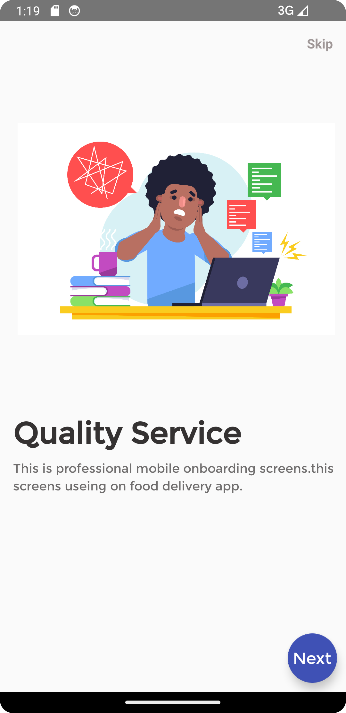
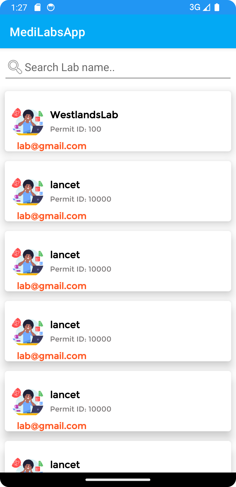

## Guide to MediLabApp
In this Guide, You will learn how to create an advanced mobile app, 
The application to be developed is an online Lab Tests Booking System which will allow patients book for specific Lab Tests form different Laboratories, 
it includes Authentication module, Services Listing, Shopping Cart Module, Maps and GPS Module, Fragments, Payment, APIs etc,
This app is inspired by Online Booking Apps such as Glovo, Uber Eats, Booking.com, Yum, Jumia Foods etc.

### Prerequisites
In order to develop this app, you must have an understanding of Kotlin Language and have Android Application Development Fundamentals.
 

This mobile application consumes an API in the backend, If you have not created the API, Please follow below link  
https://github.com/modcomlearning/medilab

### Part 1
#### Step 1 : App Structure
In this step we understand the app structure.
Create a New Android App. Use Empty Views Activity.

NB: Please use a different unique Package.  

In your app Package under Kotlin + Java, create four subpackages namely;  
adapters - To be used to store our Adapters used by Recycler Views 
constants - To be used in storing Constants variables that are used across the application  
helpers - To be used to hold helpers that help us with different functionalities in our App i.e APIHelper 
models - This package will store models that define the data we will be working on. 

in res Folder, create a subfolder named 'font' and place sample fonts inside.  
Download Fonts from here https://www.fontsquirrel.com/fonts/list/popular     

#### Creating the Start Screens, Screen1 and Screen2.
Right click your main package, Create a New Empty Views activity named Screen1 and another one named Screen2.
In drawable Folder place 2 images to be shown in screen1 and screen2  

In activity_screen1.xml Write below code.  
In below code, we have used an image stored in res/drawable and a font stored in res/fonts

        <?xml version="1.0" encoding="utf-8"?>
        <LinearLayout xmlns:android="http://schemas.android.com/apk/res/android"
        xmlns:app="http://schemas.android.com/apk/res-auto"
        xmlns:tools="http://schemas.android.com/tools"
        android:layout_width="match_parent"
        android:orientation="vertical"
        android:layout_height="match_parent"
        tools:context=".Screen1">
        
            <LinearLayout
                android:layout_width="match_parent"
                android:layout_height="wrap_content"
                android:orientation="horizontal"
                android:layout_marginRight="15dp"
                android:layout_marginTop="15dp"
                >
        
                <com.google.android.material.textview.MaterialTextView
                    android:id="@+id/skip1"
                    android:layout_width="match_parent"
                    android:layout_height="wrap_content"
                    android:text="Skip"
                    android:fontFamily="@font/montserrat"
                    android:textAlignment="textEnd"
                    android:textColor="#9F9797"
                    android:textStyle="bold"
                    android:textSize="15sp"/>
            </LinearLayout>
        
        
        
               <com.google.android.material.textview.MaterialTextView
                   android:layout_width="match_parent"
                   android:layout_height="wrap_content"
                   android:text="Book Your Lab"
                   android:textAlignment="textStart"
                   android:layout_marginTop="100dp"
                   android:fontFamily="@font/montserrat"
                   android:layout_marginLeft="15dp"
                   android:textColor="#353232"
                   android:textStyle="bold"
                   android:textSize="34sp"/>
        
            <com.google.android.material.textview.MaterialTextView
                android:layout_width="match_parent"
                android:layout_height="wrap_content"
                android:text="This is professional mobile onboarding screens.this screens useing on food delivery app."
                android:textAlignment="textStart"
                android:layout_marginTop="10dp"
                android:layout_marginLeft="15dp"
                android:fontFamily="@font/montserrat"
                android:textColor="#706E6E"
                android:textStyle="normal"
                android:lineHeight="20dp"
                android:textSize="14sp"/>
        
        
               <ImageView
                   android:layout_width="400dp"
                   android:layout_height="300dp"
                   android:src="@drawable/screen11"
                   android:padding="20dp"/>
        
        
            <androidx.coordinatorlayout.widget.CoordinatorLayout
                android:layout_width="match_parent"
                android:layout_height="match_parent">
                <com.google.android.material.floatingactionbutton.FloatingActionButton
                    android:id="@+id/fab"
                    android:layout_width="wrap_content"
                    android:layout_height="wrap_content"
                    android:layout_gravity="bottom|end"
                    android:layout_margin="10dp"
                    app:backgroundTint="#3F51B5" />
                <TextView
                    android:layout_height="wrap_content"
                    android:layout_width="wrap_content"
                    android:text="Next"
                    android:elevation="6dp"
                    android:textSize="18dp"
                    android:fontFamily="@font/montserrat"
                    android:textColor="#fff"
                    app:layout_anchor="@id/fab"
                    app:layout_anchorGravity="center"/>
            </androidx.coordinatorlayout.widget.CoordinatorLayout>
        
        </LinearLayout>

In Screen1.kt Write below code  

    package com.modcom.medilabsapp
    
    import android.content.Intent
    import androidx.appcompat.app.AppCompatActivity
    import android.os.Bundle
    import com.google.android.material.floatingactionbutton.FloatingActionButton
    import com.google.android.material.textview.MaterialTextView
    class Screen1 : AppCompatActivity() {
    override fun onCreate(savedInstanceState: Bundle?) {
    super.onCreate(savedInstanceState)
    setContentView(R.layout.activity_screen1)

        //Find Views by ID
        val skip1 = findViewById<MaterialTextView>(R.id.skip1)
        //Button to Go Next to Screen 2
        skip1.setOnClickListener {
            startActivity(Intent(applicationContext, MainActivity::class.java))
        }// End
        
        //Button to Skip to Main Activity
        val fab = findViewById<FloatingActionButton>(R.id.fab)
        fab.setOnClickListener {
            startActivity(Intent(applicationContext, Screen2::class.java))
        }// End

     }
    }

In above code, when a user clicks Skip button it directs to MainActivity, when a user clicks Next Button it Goes to Screen2  

In activity_screen2.xml, write below code
In below code, we have used an image stored in res/drawable and a font stored in res/fonts

        <?xml version="1.0" encoding="utf-8"?>
        <LinearLayout xmlns:android="http://schemas.android.com/apk/res/android"
        xmlns:app="http://schemas.android.com/apk/res-auto"
        xmlns:tools="http://schemas.android.com/tools"
        android:layout_width="match_parent"
        android:orientation="vertical"
        android:layout_height="match_parent"
        tools:context=".Screen1">
        
            <LinearLayout
                android:layout_width="match_parent"
                android:layout_height="wrap_content"
                android:orientation="horizontal"
                android:layout_marginRight="15dp"
                android:layout_marginTop="15dp"
                >
        
                <com.google.android.material.textview.MaterialTextView
                    android:id="@+id/skip2"
                    android:layout_width="match_parent"
                    android:layout_height="wrap_content"
                    android:text="Skip"
                    android:textAlignment="textEnd"
                    android:textColor="#9F9797"
                    android:textStyle="bold"
                    android:textSize="15sp"/>
            </LinearLayout>
        
        
            <ImageView
                android:layout_width="400dp"
                android:layout_height="400dp"
                android:src="@drawable/screen1"
                android:padding="20dp"/>
        
            <com.google.android.material.textview.MaterialTextView
                android:layout_width="match_parent"
                android:layout_height="wrap_content"
                android:text="Quality Service"
                android:textAlignment="textStart"
                android:layout_marginTop="10dp"
                android:layout_marginLeft="15dp"
                android:textColor="#353232"
                android:fontFamily="@font/montserrat"
                android:textStyle="bold"
                android:textSize="34sp"/>
        
            <com.google.android.material.textview.MaterialTextView
                android:layout_width="match_parent"
                android:layout_height="wrap_content"
                android:text="This is professional mobile onboarding screens.this screens useing on food delivery app."
                android:textAlignment="textStart"
                android:layout_marginTop="10dp"
                android:layout_marginLeft="15dp"
                android:textColor="#706E6E"
                android:textStyle="normal"
                android:fontFamily="@font/montserrat"
                android:lineHeight="20dp"
                android:textSize="14sp"/>
        
        
        
        
        
            <androidx.coordinatorlayout.widget.CoordinatorLayout
                android:layout_width="match_parent"
                android:layout_height="match_parent">
                <com.google.android.material.floatingactionbutton.FloatingActionButton
                    android:id="@+id/fab2"
                    android:layout_width="wrap_content"
                    android:layout_height="wrap_content"
                    android:layout_gravity="bottom|end"
                    android:layout_margin="10dp"
                    app:backgroundTint="#3F51B5" />
                <TextView
                    android:layout_height="wrap_content"
                    android:layout_width="wrap_content"
                    android:text="Next"
                    android:elevation="6dp"
                    android:textSize="18dp"
                    android:textColor="#fff"
                    android:fontFamily="@font/montserrat"
                    app:layout_anchor="@id/fab2"
                    app:layout_anchorGravity="center"/>
            </androidx.coordinatorlayout.widget.CoordinatorLayout>
        
        </LinearLayout>

Then in Screen2.kt, Write the Kotlin code.  
        
        package com.modcom.medilabsapp

        import android.content.Intent
        import androidx.appcompat.app.AppCompatActivity
        import android.os.Bundle
        
        import com.google.android.material.floatingactionbutton.FloatingActionButton
        import com.google.android.material.textview.MaterialTextView
        
        class Screen2 : AppCompatActivity() {
        override fun onCreate(savedInstanceState: Bundle?) {
        super.onCreate(savedInstanceState)
        setContentView(R.layout.activity_screen2)
    
            //When user skips goes to MainActivity
            val skip2 = findViewById<MaterialTextView>(R.id.skip2)
            skip2.setOnClickListener {
                startActivity(Intent(applicationContext, MainActivity::class.java))
            }//end
    
            //When user click Next goes Still to MainActivity
            val fab2 = findViewById<FloatingActionButton>(R.id.fab2)
            fab2.setOnClickListener {
                startActivity(Intent(applicationContext, MainActivity::class.java))
            }// End
        }
    }

Finally, In Manifest File, Make Screen1 the Launcher Activity  
Also note we used android:theme="@style/Theme.AppCompat.Light.NoActionBar" theme in our Screen1 and Screen2 in Manifest below  

            <?xml version="1.0" encoding="utf-8"?>
            <manifest xmlns:android="http://schemas.android.com/apk/res/android"
            xmlns:tools="http://schemas.android.com/tools">
            <application
            android:allowBackup="true"
            android:dataExtractionRules="@xml/data_extraction_rules"
            android:fullBackupContent="@xml/backup_rules"
            android:icon="@mipmap/ic_launcher"
            android:label="@string/app_name"
            android:supportsRtl="true"
            android:theme="@style/Theme.MediLabsApp"
            tools:targetApi="31">
            
                    <activity
                        android:name=".Screen2"
                        android:exported="false"
                        android:theme="@style/Theme.AppCompat.Light.NoActionBar" />
                    <activity
                        android:name=".MainActivity"
                        android:exported="false" />
                    <activity
                        android:name=".Screen1"
                        android:exported="true"
                        android:theme="@style/Theme.AppCompat.Light.NoActionBar">
                        <intent-filter>
                            <action android:name="android.intent.action.MAIN" />
            
                            <category android:name="android.intent.category.LAUNCHER" />
                        </intent-filter>
                    </activity>
                </application>
            
            </manifest>

### Run Your App, You will have Screen1, Then Screen2 , then lands to MainActivity
 

   

#### Step 2
In this step we will work on MainActivity to load all Laboratories from API to and display in Android Recycler View 
In build.gradle(Module App), under dependencies add below lines and sync Project.

    //LoopJ for API Connections
    implementation 'com.loopj.android:android-async-http:1.4.9'
    
    // For JSON Conversions, From JSONArray to ArrayList
    implementation 'com.google.code.gson:gson:2.8.7'

    //For Swipe Refresh in Recycler View
    implementation 'androidx.swiperefreshlayout:swiperefreshlayout:1.1.0'

    //For making rounded circular imageView
    implementation 'de.hdodenhof:circleimageview:3.0.1'

Sync Your Project

In helpers Package, Add API Helper from https://justpaste.it/bewc2    

Under models Package, create a Kotlin Class Lab.kt and write below code.
Below code creates/defines our variables as per the Laboratories API.
This model will be used in Our Recycler View Adapter to define our data 
NB: The variable names MUST be the same as keys in your API.

Lab.kt

    //Package ...
    class Lab (
      val email: String = "",
      val lab_id:String = "",
      val lab_name: String = "",
      val permit_id: String = "",
      val phone: String = "",
      val reg_date: String = ""
    )

   
Next, in res/layout, create a file named single_lab.xml and place below code, This file will be used by our LabAdapter 
in below code, we use de.hdodenhof.circleimageview.CircleImageView and place screen11 image on It.
single_lab.xml

    <?xml version="1.0" encoding="utf-8"?>
    <androidx.cardview.widget.CardView
    xmlns:app="http://schemas.android.com/apk/res-auto"
    xmlns:android="http://schemas.android.com/apk/res/android"
    android:layout_width="match_parent"
    android:layout_height="wrap_content"
    app:cardElevation="10dp"
    android:layout_margin="8dp"
    app:cardCornerRadius="5dp">
    
    <RelativeLayout
    android:layout_width="match_parent"
    android:layout_height="100dp">
    
        <de.hdodenhof.circleimageview.CircleImageView
            android:id="@+id/labimage"
            android:layout_width="55dp"
            android:layout_height="55dp"
            android:src="@drawable/screen1"
            android:layout_centerVertical="true"
            android:layout_marginLeft="10dp"/>
    
           <LinearLayout
               android:id="@+id/linear1"
               android:layout_width="wrap_content"
               android:layout_height="wrap_content"
               android:layout_centerVertical="true"
               android:layout_toEndOf="@id/labimage"
               android:orientation="vertical"
               android:layout_marginLeft="10dp">
    
               <com.google.android.material.textview.MaterialTextView
                   android:layout_width="wrap_content"
                   android:layout_height="wrap_content"
                   android:text="Lancet Pathologists"
                   android:textStyle="bold"
                   android:textSize="16sp"
                   android:fontFamily="@font/montserrat"
                   android:textColor="@color/black"
                   android:id="@+id/lab_name"/>
    
               <com.google.android.material.textview.MaterialTextView
                   android:layout_width="wrap_content"
                   android:layout_height="wrap_content"
                   android:text="Permit ID: 457878"
                   android:textStyle="normal"
                   android:textSize="12sp"
                   android:fontFamily="@font/montserrat"
                   android:textColor="#787474"
                   android:layout_marginTop="6dp"
                   android:id="@+id/permit_id"/>
           </LinearLayout>
    
          <LinearLayout
              android:layout_width="wrap_content"
              android:layout_height="wrap_content"
    
              android:layout_below="@id/linear1"
              android:layout_marginTop="5dp"
              android:layout_marginLeft="20dp"
              android:orientation="vertical">
    
              <com.google.android.material.textview.MaterialTextView
                  android:layout_width="wrap_content"
                  android:layout_height="wrap_content"
                  android:text="lancet@gmail.com"
                  android:textStyle="bold"
                  android:textSize="15sp"
                  android:fontFamily="@font/montserrat"
                  android:textColor="#FF5722"
                  android:layout_marginTop="6dp"
                  android:id="@+id/email"/>
          </LinearLayout>
    </RelativeLayout>
    </androidx.cardview.widget.CardView>

The layout above shows how a single item is displayed on RecyclerView

 
In adapters Package, Create a Class File named LabAdapter.kt and write below code  
        LabAdapter.kt       

        package com.modcom.medilabsapp.adapters
        import android.content.Context
        import android.view.LayoutInflater
        import android.view.View
        import android.view.ViewGroup
        import androidx.recyclerview.widget.RecyclerView
        import com.google.android.material.textview.MaterialTextView
        import com.modcom.medilabsapp.R
        import com.modcom.medilabsapp.models.Lab
        
        //We provide context in below class to make it be like an activity
        class LabAdapter(var context: Context):
        RecyclerView.Adapter<LabAdapter.ViewHolder>() {
            //Create a List and connect it with our model
            var itemList : List<Lab> = listOf() //Its empty
        
            //Create a Class here, will hold our views in single_lab xml
            inner class  ViewHolder(itemView: View):  RecyclerView.ViewHolder(itemView)

            //Access single_lab XML
            override fun onCreateViewHolder(parent: ViewGroup, viewType: Int): LabAdapter.ViewHolder {
                //access/inflate the single lab xml
                val view = LayoutInflater.from(parent.context).inflate(R.layout.single_lab,
                    parent, false)
        
                return ViewHolder(view) //pass the single lab to ViewHolder
            }
            
            // Bind data to Views from single_lab XML
            override fun onBindViewHolder(holder: LabAdapter.ViewHolder, position: Int) {
                 //Find your 3 text views
                val lab_name = holder.itemView.findViewById<MaterialTextView>(R.id.lab_name)
                val permit_id = holder.itemView.findViewById<MaterialTextView>(R.id.permit_id)
                val email = holder.itemView.findViewById<MaterialTextView>(R.id.email)
                //Assume one Lab, and bind data, it will loop other Labs
                 val lab = itemList[position]
                 lab_name.text = lab.lab_name
                 permit_id.text = "Permit ID: "+lab.permit_id
                 email.text = lab.email
                //When one Lab is clicked, Move to Lab tests Activity
                 holder.itemView.setOnClickListener {
                    //To Navigate to LabTests on each Lab Click
                     
                 }
        
            }
            //Count Number of items
            override fun getItemCount(): Int {
                return itemList.size  //Count how may Items in the List
            }
            
        
            //Earlier we mentioned item List is empty!
            //We will get data from our APi, then bring it to below function
            //The data you bring here must follow the Lab model
            fun setListItems(data: List<Lab>){
                itemList = data //map/link the data to itemlist
                notifyDataSetChanged()
                //Tell this adapter class that now itemList is loaded with data
            }
            //justpaste.it/cgaym
        }

Go to activity_main.xml and Place this code which has a ProgressBar , SwipeRefresh and a RecyclerView  

        <?xml version="1.0" encoding="utf-8"?>
        <LinearLayout
        xmlns:android="http://schemas.android.com/apk/res/android"
        xmlns:app="http://schemas.android.com/apk/res-auto"
        xmlns:tools="http://schemas.android.com/tools"
        android:layout_width="match_parent"
        android:layout_height="match_parent"
        android:orientation="vertical"
        tools:context=".MainActivity">
        
            <ProgressBar
                android:layout_width="match_parent"
                android:layout_height="wrap_content"
                android:layout_margin="3dp"
                android:id="@+id/progress"/>

            <androidx.swiperefreshlayout.widget.SwipeRefreshLayout
                android:layout_width="match_parent"
                android:layout_height="wrap_content"
                android:id="@+id/swipeRefreshLayout">
            
                <androidx.recyclerview.widget.RecyclerView
                    android:id="@+id/recycler"
                    android:layout_width="match_parent"
                    android:layout_height="match_parent"
                    tools:listitem="@layout/single_lab"/>
            
            </androidx.swiperefreshlayout.widget.SwipeRefreshLayout>

        </LinearLayout>

In MainActivity.kt Write below code.

        package com.modcom.medilabsapp
        import androidx.appcompat.app.AppCompatActivity
        import android.os.Bundle
        import android.util.Log
        import android.view.View
        import android.widget.ProgressBar
        import android.widget.Toast
        import androidx.recyclerview.widget.LinearLayoutManager
        import androidx.recyclerview.widget.RecyclerView
        import com.google.gson.GsonBuilder
        import com.modcom.medilabsapp.adapters.LabAdapter
        import com.modcom.medilabsapp.constants.Constants
        import com.modcom.medilabsapp.helpers.ApiHelper
        import com.modcom.medilabsapp.models.Lab
        import org.json.JSONArray
        import org.json.JSONObject
        
        class MainActivity : AppCompatActivity() {
        //Global Declaration - they can be accessed all over this class.
        // Declare variables as lateinit means they are guaranteed to be initialized in the future
        lateinit var itemList: List<Lab>
        lateinit var labAdapter: LabAdapter
        lateinit var recyclerView: RecyclerView
        lateinit var progress: ProgressBar
        
        
        
            override fun onCreate(savedInstanceState: Bundle?) {
                super.onCreate(savedInstanceState)
                setContentView(R.layout.activity_main)
                //Find Views
                progress = findViewById(R.id.progress)
                recyclerView = findViewById(R.id.recycler)
                //Link to adapter
                labAdapter = LabAdapter(applicationContext)
                //Set recycler adapter layout manager
                recyclerView.layoutManager = LinearLayoutManager(applicationContext)
                recyclerView.setHasFixedSize(true)
                //Call the function to fetch data
                fetchData()
        
            }//end Oncreate
        
            // FUnctions to Fetch Laboratories from API and Bind then in Recycler View
            fun fetchData(){
                //Go to the PAi get the dataapplicationContextthis
                val api = Constants.BASE_URL+"/laboratories"
                val helper = ApiHelper(this@MainActivity)
                helper.get(api, object: ApiHelper.CallBack{
                    override fun onSuccess(result: JSONArray?) {
                        //Take above result to adapter
                        //Convert Above result from JSON array to LIST<Lab>
                        val gson = GsonBuilder().create()
                        itemList = gson.fromJson(result.toString(),
                            Array<Lab>::class.java).toList()
                        //Finally, our adapter has the data
                        labAdapter.setListItems(itemList)
                        //For the sake of recycling/Looping items, add the adapter to recycler
                        recyclerView.adapter = labAdapter
                        progress.visibility = View.GONE
        
                    }//end
        
                    override fun onSuccess(result: JSONObject?) {
        
                    }
        
                    override fun onFailure(result: String?) {
                        Toast.makeText(applicationContext, "Error:"+result.toString(),
                            Toast.LENGTH_SHORT).show()
                        Log.d("failureerrors", result.toString())
                        progress.visibility = View.GONE
                    }
                })
            }//end fetch data
        
            //End
        }

Run your App
 

Adding Swipe Refresh, We already have a SwipeRefresh View in activity_main.xml, in MainActivity.kt we just need to find it and apply a swipe refresh listener.  
Below is updated code with SwipeRefresh

        package com.modcom.medilabsapp
        import androidx.appcompat.app.AppCompatActivity
        import android.os.Bundle
        import android.util.Log
        import android.view.View
        import android.widget.ProgressBar
        import android.widget.Toast
        import androidx.recyclerview.widget.LinearLayoutManager
        import androidx.recyclerview.widget.RecyclerView
        import androidx.swiperefreshlayout.widget.SwipeRefreshLayout
        import com.google.gson.GsonBuilder
        import com.modcom.medilabsapp.adapters.LabAdapter
        import com.modcom.medilabsapp.constants.Constants
        import com.modcom.medilabsapp.helpers.ApiHelper
        import com.modcom.medilabsapp.models.Lab
        import org.json.JSONArray
        import org.json.JSONObject
        
        class MainActivity : AppCompatActivity() {
        //Global Declaration - they can be accessed all over this class
        lateinit var itemList: List<Lab>
        lateinit var labAdapter: LabAdapter
        lateinit var recyclerView: RecyclerView
        lateinit var progress: ProgressBar
        //add Swipe refresh declaration
        lateinit var swiperefresh: SwipeRefreshLayout
        
        
            override fun onCreate(savedInstanceState: Bundle?) {
                super.onCreate(savedInstanceState)
                setContentView(R.layout.activity_main)
                //Find Views
                progress = findViewById(R.id.progress)
                recyclerView = findViewById(R.id.recycler)
                //Link to adapter
                labAdapter = LabAdapter(applicationContext)
                //Set recycler adapter layout manager
                recyclerView.layoutManager = LinearLayoutManager(applicationContext)
                recyclerView.setHasFixedSize(true)
                //Call the function to fetch data
                fetchData()
                //FInd swipe refresh and set refresh Listener
                swiperefresh = findViewById<SwipeRefreshLayout>(R.id.swipeRefreshLayout)
                swiperefresh.setOnRefreshListener {
                    fetchData()// fetch data again
                }//end refresh
        
            }//end Oncreate
        
            fun fetchData(){
                //Go to the PAi get the dataapplicationContextthis
                val api = Constants.BASE_URL+"/laboratories"
                val helper = ApiHelper(this@MainActivity)
                helper.get(api, object: ApiHelper.CallBack{
                    override fun onSuccess(result: JSONArray?) {
                        //Take above result to adapter
                        //Convert Above result from JSON array to LIST<Lab>
                        val gson = GsonBuilder().create()
                        itemList = gson.fromJson(result.toString(),
                            Array<Lab>::class.java).toList()
                        //Finally, our adapter has the data
                        labAdapter.setListItems(itemList)
                        //For the sake of recycling/Looping items, add the adapter to recycler
                        recyclerView.adapter = labAdapter
                        //set is progress to gone when records are loaded
                        progress.visibility = View.GONE
                        //set is refreshing to false when records are loaded
                        swiperefresh.isRefreshing = false
        
                    }//end
        
                    override fun onSuccess(result: JSONObject?) {
        
                    }
        
                    override fun onFailure(result: String?) {
                        Toast.makeText(applicationContext, "Error:"+result.toString(),
                            Toast.LENGTH_SHORT).show()
                        Log.d("failureerrors", result.toString())
                        progress.visibility = View.GONE
                    }
                })
            }//end fetch data
        }

Run your App, Observe the Pull Refresh
 

#### Step 3
Adding a Search Filter.  
In activity_main.xml and an EditText for search  
Below is updated activity_main.xml  

        <?xml version="1.0" encoding="utf-8"?>
        <LinearLayout
        xmlns:android="http://schemas.android.com/apk/res/android"
        xmlns:app="http://schemas.android.com/apk/res-auto"
        xmlns:tools="http://schemas.android.com/tools"
        android:layout_width="match_parent"
        android:layout_height="match_parent"
        android:orientation="vertical"
        tools:context=".MainActivity">

            <EditText
                android:layout_width="match_parent"
                android:layout_height="wrap_content"
                android:hint="Search Lab name.."
                android:drawableStart="@android:drawable/ic_menu_search"
                android:layout_margin="5dp"
                android:id="@+id/etsearch"/>
            
            <ProgressBar
                android:layout_width="match_parent"
                android:layout_height="wrap_content"
                android:layout_margin="3dp"
                android:id="@+id/progress"/>
        
        
        <androidx.swiperefreshlayout.widget.SwipeRefreshLayout
        android:layout_width="match_parent"
        android:layout_height="wrap_content"
        android:id="@+id/swipeRefreshLayout">
        
            <androidx.recyclerview.widget.RecyclerView
                android:id="@+id/recycler"
                android:layout_width="match_parent"
                android:layout_height="match_parent"
                tools:listitem="@layout/single_lab"/>
        
        </androidx.swiperefreshlayout.widget.SwipeRefreshLayout>
    </LinearLayout>

Next in MainActivity.kt add below function code from https://justpaste.it/9j21s
This filter function filters data in the recycler view using the Adapter

           private fun filter(text: String) {
            // creating a new array list to filter our data.
            val filteredlist: ArrayList<Lab> = ArrayList()
    
            // running a for loop to compare elements.
            for (item in itemList) {
                // checking if the entered string matched with any item of our recycler view.
                if (item.lab_name.lowercase().contains(text.lowercase())) {
                    // if the item is matched we are
                    // adding it to our filtered list.
                    filteredlist.add(item)
                }
            }
            if (filteredlist.isEmpty()) {
                // if no item is added in filtered list we are
                // displaying a toast message as no data found.
                //Toast.makeText(this, "No Data Found..", Toast.LENGTH_SHORT).show()
                labAdapter.filterList(filteredlist)
            } else {
                // at last we are passing that filtered
                // list to our adapter class.
                labAdapter.filterList(filteredlist)
            }
        }

Then in MainActivity.kt inside oncreate function write below code.
Below code adds a Text Changed Listener to EditText, onTextChanged it calls filter function

              //Filter Labs
                val etsearch = findViewById<EditText>(R.id.etsearch)
                etsearch.addTextChangedListener(object: TextWatcher{
                    override fun beforeTextChanged(p0: CharSequence?, p1: Int, p2: Int, p3: Int) {
        
                    }
        
                    override fun onTextChanged(texttyped: CharSequence?, p1: Int, p2: Int, p3: Int) {
                         filter(texttyped.toString())
                    }
        
                    override fun afterTextChanged(p0: Editable?) {
        
                    }
        
                })

Final Code for MainActivity.kt

    package com.modcom.medilabsapp
    import androidx.appcompat.app.AppCompatActivity
    import android.os.Bundle
    import android.text.Editable
    import android.text.TextWatcher
    import android.util.Log
    import android.view.View
    import android.widget.EditText
    import android.widget.ProgressBar
    import android.widget.Toast
    import androidx.recyclerview.widget.LinearLayoutManager
    import androidx.recyclerview.widget.RecyclerView
    import androidx.swiperefreshlayout.widget.SwipeRefreshLayout
    import com.google.gson.GsonBuilder
    import com.modcom.medilabsapp.adapters.LabAdapter
    import com.modcom.medilabsapp.constants.Constants
    import com.modcom.medilabsapp.helpers.ApiHelper
    import com.modcom.medilabsapp.models.Lab
    import org.json.JSONArray
    import org.json.JSONObject
    
    class MainActivity : AppCompatActivity() {
    //Global Declaration - they can be accessed all over this class
    lateinit var itemList: List<Lab>
    lateinit var labAdapter: LabAdapter
    lateinit var recyclerView: RecyclerView
    lateinit var progress: ProgressBar
    lateinit var swiperefresh: SwipeRefreshLayout
    
    
        override fun onCreate(savedInstanceState: Bundle?) {
            super.onCreate(savedInstanceState)
            setContentView(R.layout.activity_main)
    
            progress = findViewById(R.id.progress)
            recyclerView = findViewById(R.id.recycler)
            labAdapter = LabAdapter(applicationContext)
            recyclerView.layoutManager = LinearLayoutManager(applicationContext)
            recyclerView.setHasFixedSize(true)
            //Call the function
            fetchData()
            swiperefresh = findViewById<SwipeRefreshLayout>(R.id.swipeRefreshLayout)
            swiperefresh.setOnRefreshListener {
                fetchData()// fetch data again
            }//end refresh
    
            //Filter Labs
            val etsearch = findViewById<EditText>(R.id.etsearch)
            etsearch.addTextChangedListener(object: TextWatcher{
                override fun beforeTextChanged(p0: CharSequence?, p1: Int, p2: Int, p3: Int) {
    
                }
    
                override fun onTextChanged(texttyped: CharSequence?, p1: Int, p2: Int, p3: Int) {
                     filter(texttyped.toString())
                }
    
                override fun afterTextChanged(p0: Editable?) {
    
                }
    
            })
        }//end Oncreate
    
        fun fetchData(){
            //Go to the PAi get the dataapplicationContextthis
            val api = Constants.BASE_URL+"/laboratories"
            val helper = ApiHelper(this@MainActivity)
            helper.get(api, object: ApiHelper.CallBack{
                override fun onSuccess(result: JSONArray?) {
                    //Take above result to adapter
                    //Convert Above result from JSON array to LIST<Lab>
                    val gson = GsonBuilder().create()
                    itemList = gson.fromJson(result.toString(),
                        Array<Lab>::class.java).toList()
                    //Finally, our adapter has the data
                    labAdapter.setListItems(itemList)
                    //For the sake of recycling/Looping items, add the adapter to recycler
                    recyclerView.adapter = labAdapter
                    progress.visibility = View.GONE
                    swiperefresh.isRefreshing = false
    
                }//end
    
                override fun onSuccess(result: JSONObject?) {
    
                }
    
                override fun onFailure(result: String?) {
                    Toast.makeText(applicationContext, "Error:"+result.toString(),
                        Toast.LENGTH_SHORT).show()
                    Log.d("failureerrors", result.toString())
                    progress.visibility = View.GONE
                }
    
            })
        }//end fetch data
    
        //Filter function
        //justpaste.it/9j21s
        //Filter
        private fun filter(text: String) {
            // creating a new array list to filter our data.
            val filteredlist: ArrayList<Lab> = ArrayList()
    
            // running a for loop to compare elements.
            for (item in itemList) {
                // checking if the entered string matched with any item of our recycler view.
                if (item.lab_name.lowercase().contains(text.lowercase())) {
                    // if the item is matched we are
                    // adding it to our filtered list.
                    filteredlist.add(item)
                }
            }
            if (filteredlist.isEmpty()) {
                // if no item is added in filtered list we are
                // displaying a toast message as no data found.
                //Toast.makeText(this, "No Data Found..", Toast.LENGTH_SHORT).show()
                labAdapter.filterList(filteredlist)
            } else {
                // at last we are passing that filtered
                // list to our adapter class.
                labAdapter.filterList(filteredlist)
            }
        }
    }

Run your App
 

